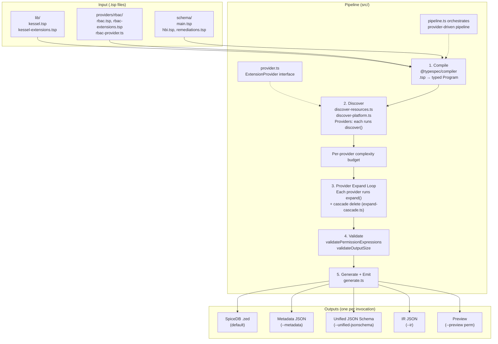

# TypeSpec-as-Schema POC

Prototype exploring [TypeSpec](https://typespec.io/) as a unified schema representation for Kessel (same RBAC + HBI benchmark as sibling POCs).

## How It Works

Service teams write `.tsp` files declaring resources and permissions. A standalone TypeScript CLI compiles them into SpiceDB schemas, metadata, and JSON Schema -- no manual wiring needed.

```
 .tsp files                     src/ + providers/

┌──────────────┐         ┌──────────────────────┐
│ lib/         │         │  1. COMPILE           │
│  kessel.tsp  │         │  TypeSpec compiler    │
│  kessel-     │────┐    │  parses .tsp into     │
│  extensions  │    │    │  a typed Program      │
│  .tsp        │    │    └──────────┬───────────┘
├──────────────┤    │               │
│ providers/   │    │    ┌──────────┴───────────┐
│  rbac/       │    │    │  2. DISCOVER          │
│   rbac.tsp   │────┤    │  Resources:           │
│   rbac-ext   │    │    │   discover-resources  │
│   .tsp       │    │    │  Platform extensions: │
│   rbac-      │    │    │   discover-platform   │
│   provider.ts│    │    │  Providers: each runs  │
├──────────────┤    │    │   own discover()       │
│ schema/      │    │    └──────────┬───────────┘
│  main.tsp    │────┤               │
│  hbi.tsp     │────┤    ┌──────────┴───────────┐
│  remediations│    │    │  3. PROVIDER EXPAND   │         Outputs
│  .tsp        │────┘    │  Each ExtensionProvider│
└──────────────┘         │  runs expand():        │  ┌────────────────────┐
                         │  • RBAC: 7 mutations   │  │ SpiceDB .zed       │
                         │    per V1 permission   │  │ (default)          │
                         │  Then cascade delete    │  ├────────────────────┤
                         │  (expand-cascade.ts)    │  │ Metadata JSON      │
                         └──────────┬───────────┘  │ (--metadata)        │
                                    │              ├────────────────────┤
                         ┌──────────┴───────────┐  │ Unified JSON Schema│
                         │  4. VALIDATE          │  │ (--unified-        │
                         │  (safety.ts)          │  │  jsonschema)       │
                         │  • per-provider budget │  ├────────────────────┤
                         │  • expression refs     │  │ IR JSON            │
                         │  • output size         │  │ (--ir)             │
                         └──────────┬───────────┘  ├────────────────────┤
                                    │              │ Preview            │
                                    │              │ (--preview <perm>) │
                         ┌──────────┴───────────┐  └─────────▲─────────┘
                         │  5. GENERATE + EMIT   │           │
                         │  (generate.ts)        │───────────┘
                         └──────────────────────┘

  Pipeline orchestration: pipeline.ts (compile → discover → provider expand → validate → generate)
  Provider registration: providers implement ExtensionProvider interface (src/provider.ts)
```

## Quick Start

```bash
npm install
npx tsx src/spicedb-emitter.ts schema/main.tsp                                # SpiceDB output
npx tsx src/spicedb-emitter.ts schema/main.tsp --metadata                     # per-service metadata
npx tsx src/spicedb-emitter.ts schema/main.tsp --unified-jsonschema           # relationship-derived JSON Schemas
npx tsx src/spicedb-emitter.ts schema/main.tsp --annotations                  # resource annotations
npx tsx src/spicedb-emitter.ts schema/main.tsp --ir                           # full IR for Go consumer
npx tsx src/spicedb-emitter.ts schema/main.tsp --preview inventory_host_view  # preview single extension
npx vitest run                                                                # 206 tests
make demo                                                                     # all outputs in one console tour
```

## What Service Teams Write

A service team adds **one `.tsp` file** with two things:

**1. Register permissions** (one alias per permission):

```typespec
alias viewPermission = Kessel.V1WorkspacePermission<
  "inventory", "hosts", "read", "inventory_host_view"
>;
```

This single line triggers 7 mutations across Role, RoleBinding, and Workspace.

**2. Define the resource model:**

```typespec
model Host {
  workspace: Assignable<RBAC.Workspace, Cardinality.ExactlyOne>;
  view: Permission<"workspace.inventory_host_view">;
  update: Permission<"workspace.inventory_host_update">;
}
```

Then add one import to `schema/main.tsp`. Done. No TypeScript changes needed.

## Architecture



### Decorators vs CLI Pipeline

This project does **not** use custom TypeSpec decorators or a registered TypeSpec emitter plugin (`$onEmit`). Instead:

- **Built-in validation decorators only** — standard decorators like `@doc`, `@format`, `@pattern`, and `@maxLength` are used directly on flat resource models (see `schema/hbi.tsp`). The CLI walks the compiled `Program`, extracts non-Kessel data fields, and emits the unified JSON schema itself. Service payload schemas are no longer modeled as nested `*Data` types decorated with `@jsonSchema`.
- **Model templates as data carriers** — `V1WorkspacePermission` (in `providers/rbac/rbac-extensions.tsp`), `CascadeDeletePolicy`, and `ResourceAnnotation` (in `lib/kessel-extensions.tsp`) are plain TypeSpec `model` definitions with type parameters. They carry parameters but have zero compile-time behavior. Expansion logic is owned by the provider that defines the template.
- **Provider-owned expansion** — Extension providers (like RBAC) implement the `ExtensionProvider` interface to own their discovery and expansion logic. The RBAC provider in `providers/rbac/rbac-provider.ts` owns the 7 mutations, `view_metadata` accumulation, and scaffold wiring. The platform pipeline orchestrates providers without hard-coding domain logic.
- **Standalone CLI** — `spicedb-emitter.ts` calls `compile()` from `@typespec/compiler` to get a `Program` object, then runs the provider-driven pipeline. It is not registered as a TypeSpec emitter plugin — it is a standalone script that uses the compiler as a library. A `--watch` flag re-runs the pipeline on `.tsp` file changes without needing TypeSpec's plugin watch infrastructure.
- **Two-pass expression validation** — Permission expressions (`Permission<"expr">`) are validated both pre-expansion (catches typos in service-authored schemas before RBAC mutations) and post-expansion (catches cross-resource reference errors in the fully expanded schema).
- **Discovery health tracking** — Alias resolution stats (`aliasesAttempted`, `aliasesResolved`, `resourcesFound`, `extensionsFound`) are tracked during discovery and surfaced as warnings when aliases are skipped, making silent regressions in the name-based discovery path visible.

This approach was chosen so the full pipeline is visible in one file (`pipeline.ts`) and can be tested without TypeSpec plugin infrastructure. For the roadmap toward converting to a plugin, see [docs/Emitter-Plugin-Roadmap.md](docs/Emitter-Plugin-Roadmap.md).

### The 7 Mutations Per Extension

When a service declares `V1WorkspacePermission<"inventory", "hosts", "read", "inventory_host_view">`, the expansion function adds:

| # | Target | What | Example |
|---|--------|------|---------|
| 1-4 | Role | 4 bool relations (hierarchy) | `inventory_any_any`, `inventory_hosts_any`, `inventory_any_read`, `inventory_hosts_read` |
| 5 | Role | Union permission | `inventory_host_view = any_any_any + inventory_any_any + ...` |
| 6 | RoleBinding | Intersection permission | `inventory_host_view = (subject & t_granted->inventory_host_view)` |
| 7 | Workspace | Union permission | `inventory_host_view = t_binding->... + t_parent->...` |

After all extensions, read-verb permissions are OR'd into `view_metadata` on Workspace.

## File Structure

```
lib/                             Platform types (shared)
  kessel.tsp                       Assignable, Permission, BoolRelation, Cardinality
  kessel-extensions.tsp            Platform templates: CascadeDeletePolicy, ResourceAnnotation

providers/                       Service providers (own their extension logic)
  rbac/
    rbac.tsp                       Core RBAC types: Principal, Role, RoleBinding, Workspace
    rbac-extensions.tsp            RBAC extension template: V1WorkspacePermission
    rbac-provider.ts               RBAC ExtensionProvider: discover + expand (7 mutations)

schema/                          Service schemas (teams own their files)
  main.tsp                         Entrypoint — imports providers + services
  hbi.tsp                          Host resource + V1 permission aliases + annotations
  remediations.tsp                 Permissions-only service

src/                             Platform CLI + pipeline
  provider.ts                      ExtensionProvider interface
  primitives.ts                    Low-level graph builders: ref, subref, or, and, addRelation, hasRelation
  expand-cascade.ts                Platform cascade-delete expansion (provider-neutral)
  types.ts                         Core interfaces: ResourceDef, RelationBody, ProviderDiscoveryResult, IR
  utils.ts                         Shared helpers: bodyToZed, slotName, findResource, cloneResources
  parser.ts                        Recursive-descent parser for permission expressions
  registry.ts                      Template registry: buildRegistry(providers) + PLATFORM_TEMPLATES
  discover-extensions.ts           Reusable template instance walking (used by providers + platform)
  discover-platform.ts             Platform-owned annotation + cascade-delete discovery
  discover-resources.ts            Resource graph extraction from the TypeSpec AST
  pipeline.ts                      Provider-driven pipeline: compile → discover → provider expand → generate
  generate.ts                      Output generators: SpiceDB, JSON Schema, metadata, IR
  safety.ts                        Per-provider weighted cost budgets, timeout, output size, validation
  lib.ts                           Barrel module re-exporting all public API
  spicedb-emitter.ts               CLI entry point (composition root)

test/                            Tests
  unit/                            Pure unit tests (no TypeSpec compilation)
  integration/                     Full pipeline + golden output comparison + CLI smoke tests
```

## Output Formats

| Output | Flag | Format | Audience | Scope |
|---|---|---|---|---|
| SpiceDB | *(default)* | Zed DSL | Authorization engine | Full authz schema with cascade-delete permissions |
| Metadata | `--metadata` | JSON | Platform tooling | Per-service permissions, resources, cascade policies, annotations |
| Unified JSON Schema | `--unified-jsonschema` | JSON Schema | API servers/clients | Per-resource payload contracts |
| Annotations | `--annotations` | JSON | Platform tooling | Flattened key/value annotations per resource |
| IR | `--ir [path]` | JSON | Go binaries, CI | All of the above + raw type graph |
| Preview | `--preview <perm>` | Human text | Service developers | Single extension mutation trace + cascade policy impact |

## Risks and Tradeoffs

- **Node.js in CI** for `tsp` + `tsx`; Go loader example (`go-loader-example/`) needs no Node at runtime
- **New extension types** require a new provider implementing `ExtensionProvider` and registration in the CLI composition root (`spicedb-emitter.ts`)
- **Custom unified JSON schema path** — the CLI derives service payload schema from flat resource models so it can omit Kessel-only relation/permission internals while preserving service-authored validation metadata

## Future: TypeSpec Emitter Plugin

The current standalone CLI architecture is intentional — see [Decorators vs CLI Pipeline](#decorators-vs-cli-pipeline) above. For the roadmap toward converting to a registered TypeSpec emitter plugin (`$onEmit`), including migration triggers, reuse analysis, and custom decorator opportunities, see [docs/Emitter-Plugin-Roadmap.md](docs/Emitter-Plugin-Roadmap.md).
