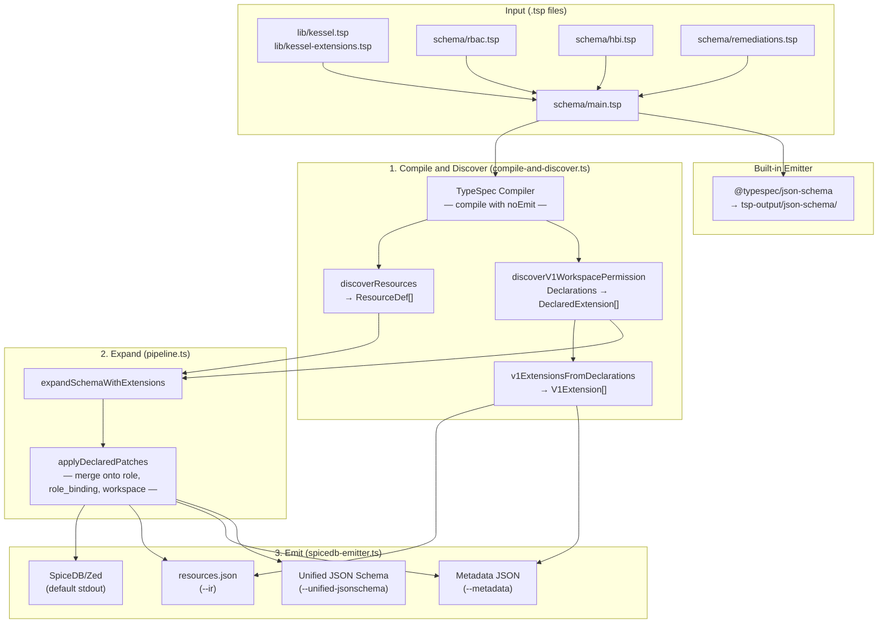

# TypeSpec-as-Schema POC

Prototype exploring [TypeSpec](https://typespec.io/) as a unified schema representation for Kessel (same RBAC + HBI benchmark as sibling POCs).

**Layout (as planned — parity with `ts-as-schema`):**

| Folder | Role |
|--------|------|
| **`schema/`** | **Adopter + composition:** `main.tsp` entrypoint and service modules only (`rbac.tsp`, `hbi.tsp`, …). No platform vocabulary here. |
| **`lib/`** | **Platform vocabulary:** `kessel.tsp` (Assignable, Permission, …) and `kessel-extensions.tsp` (`V1WorkspacePermission` + patch rules). |
| **`src/`** | **Interpreter / tooling:** TypeScript that walks the TypeSpec program and emits SpiceDB, IR, metadata, unified JSON Schema. |
| **`samples/`** | Frozen **`demo-output.txt`** from `make samples` or `make demo` (review without running Node). |
| **`go-consumer/`** | Optional Go binary that embeds emitted IR (`//go:embed`). |
| **`test/`** | Vitest (imports from `src/`). |

**One-line map:** Authors extend **`schema/`** (and import **`lib/`** for Kessel types); all codegen lives in **`src/`**. Evaluators run **`make demo`** or **`make run`** (alias) for a console tour; **`make samples`** refreshes checked-in sample output.

## Quick Start

```bash
npm install
make demo              # or: make run — SpiceDB + metadata + JSON Schema fragment on stdout
make samples           # regenerate samples/demo-output.txt (same content as demo + file header)
# or stepwise:
npx tsp compile schema/main.tsp
npx tsx src/spicedb-emitter.ts schema/main.tsp
# Optional: npx tsx src/spicedb-emitter.ts schema/main.tsp --lenient-extensions
# (skip throwing on malformed declarative patch strings; default is strict)
```

## Architecture



### Pipeline

Services register permissions by declaring aliases of **`Kessel.V1WorkspacePermission<App, Res, Verb, V2>`** in their `schema/*.tsp` file. Each alias carries four parameters (application, resource, verb, v2 permission name) and inherits declarative patch rules from the template in `lib/kessel-extensions.tsp`.

The emitter pipeline has three stages:

1. **Compile and discover** (`src/compile-and-discover.ts`) — compiles `schema/main.tsp` into a typed program, discovers base resource models (`discoverResources`), and discovers all `V1WorkspacePermission` instances (`discoverV1WorkspacePermissionDeclarations`) in a single pass.
2. **Expand** (`src/pipeline.ts`) — `expandSchemaWithExtensions` re-runs V1 discovery on the program and applies declarative patches (`applyDeclaredPatches`) to merge extension-generated relations and permissions onto `rbac/role`, `rbac/role_binding`, and `rbac/workspace`.
3. **Emit** (`src/spicedb-emitter.ts`) — produces SpiceDB/Zed text (default), IR JSON (`--ir`), per-service metadata (`--metadata`), or unified JSON Schema (`--unified-jsonschema`).

All patch-rule parsing and application lives in `src/declarative-extensions.ts`. The emitter is extension-agnostic: it knows how to parse patch-rule syntax (`boolRelations`, `permission`, `public`, `accumulate`, `addField`) but has no knowledge of specific extension patterns.

### Testing without a TypeSpec program

Unit tests that need to exercise patch application without compiling `.tsp` files use `declaredExtensionsFromV1Extensions` to build `DeclaredExtension[]` from plain `V1Extension` objects. These rely on the frozen `V1_WORKSPACE_PERMISSION_TEMPLATE_RULES` array, which must stay in sync with the template defaults in `lib/kessel-extensions.tsp`. The drift guard at `test/unit/template-rules-drift.test.ts` compiles a minimal fixture and fails if the two diverge.

### Debug: discovery warnings

If extension discovery skips a source node (checker error), set **`DISCOVER_DEBUG=1`** or **`TYPESPEC_DISCOVER_DEBUG=1`** to log `console.warn` details. Default behavior remains non-throwing for those nodes.

### Permission expressions

The emitter’s `parsePermissionExpr` maps `Permission<"...">` **string** bodies to an internal `RelationBody` tree. Only this **subset** is supported (enough for the benchmark and declarative patches):

- **Single reference:** `binding`, `subject`, `any_any_any`, … → `ref`
- **Subreference:** `binding->granted` or `t_binding->granted` style (dot form without spaces: `a.b`) → `subref` with `t_`-prefixed relation name where applicable
- **Union:** operands joined by **` | `** or **` + `** → `or` (each operand may use `name->sub` for subref)
- **Intersection:** operands joined by **` & `** → `and` (same `->` rule as union members)

Expressions mixing `&` and `|` on one line without grouping, or other Zed features, are **not** modeled; extend [`src/lib.ts`](src/lib.ts) `parsePermissionExpr` if you need more.

### How to validate end-to-end

From `poc/typespec-as-schema/`:

1. **Install deps (once)**

   ```bash
   npm install
   ```

2. **Full compile**

   ```bash
   make compile
   ```

   Confirms `schema/main.tsp` + imports type-check and the built-in JSON Schema emit runs.

3. **Automated tests**

   ```bash
   npx vitest run
   ```

   Covers declarative extensions, SpiceDB output, unified JSON Schema scoping, strict/lenient patches, and template-rule drift vs `kessel-extensions.tsp`.

4. **Console tour (optional)**

   ```bash
   make demo
   ```

   or `make run` — SpiceDB snippet + metadata + unified JSON Schema fragment on stdout.

5. **IR + Go path (no Node at runtime)**

   ```bash
   make emit-ir    # or: make all  # compile + IR + go-build
   make go-build   # if you only ran emit-ir
   ./go-consumer/bin/schema-consumer
   ```

   Confirms embedded IR loads and the Go binary prints resources/extensions.

6. **Strict vs lenient (regression check)**

   - Default: `npx tsx src/spicedb-emitter.ts schema/main.tsp` should succeed on the benchmark schema.
   - If you intentionally break a patch string in `lib/kessel-extensions.tsp`, default should throw; `npx tsx src/spicedb-emitter.ts schema/main.tsp --lenient-extensions` should not throw (may skip bad rules).

7. **Optional: refresh checked-in samples**

   ```bash
   make samples
   ```

   Regenerates `samples/demo-output.txt` for reviewers; diff if you care about golden output.

## Risks and tradeoffs

- **Node.js in CI** for `tsp` + `tsx`; Go consumer runtime needs no Node.
- **Emitter maintenance** — new extension *patch kinds* may require `src/` changes.
- **Patch DSL** — string rules are not fully validated by the TypeSpec checker.
- **Unified JSON Schema** — `jsonSchema_addField` is scoped by extension `application` (and optional `resource` slug vs model name). Omit `application` on hand-built `JsonSchemaExtraField` entries to apply everywhere (legacy). Use `--lenient-extensions` to skip throwing on malformed patch strings (default is strict).

## File structure

```
lib/
  kessel.tsp
  kessel-extensions.tsp
schema/
  main.tsp
  rbac.tsp
  hbi.tsp
  remediations.tsp
src/
  spicedb-emitter.ts
  compile-and-discover.ts
  lib.ts
  pipeline.ts
  declarative-extensions.ts
samples/
  README.md
  demo-output.txt
go-consumer/
test/
tspconfig.yaml
Makefile
```

## Benchmark highlights

| Feature | TypeSpec |
|---------|----------|
| Resource + relation modeling | Y |
| Zanzibar-style `Permission<"expr">` | Y |
| Data fields + JSON Schema | Y |
| Cooperative extensions | Y (declarative template + `src/` applicator) |
| SpiceDB / Zed | Y |

## Refresh `samples/demo-output.txt`

```bash
make samples
# equivalent:
make demo > samples/demo-output.txt 2>&1
```