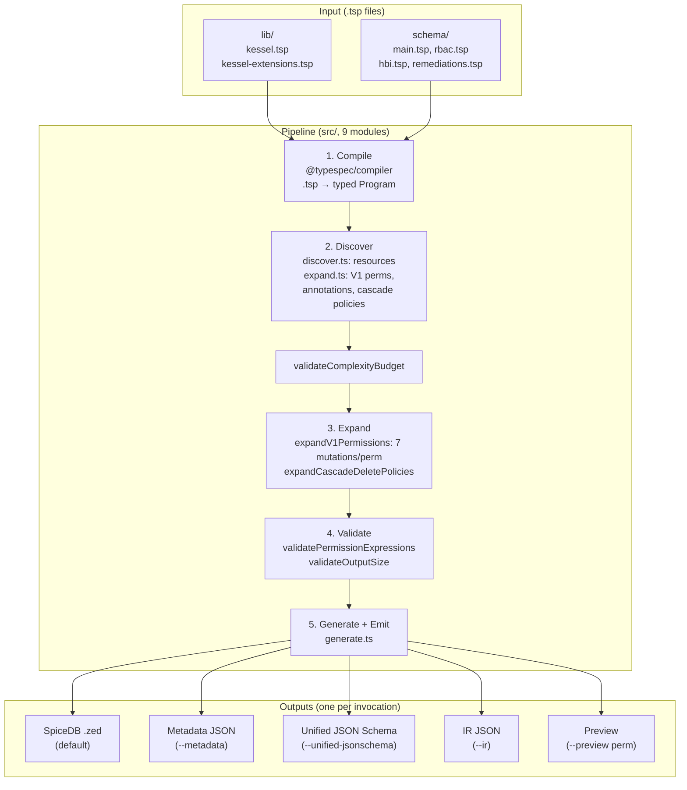

# TypeSpec-as-Schema POC

Prototype exploring [TypeSpec](https://typespec.io/) as a unified schema representation for Kessel (same RBAC + HBI benchmark as sibling POCs).

## How It Works

Service teams write `.tsp` files declaring resources and permissions. A TypeScript emitter compiles them into SpiceDB schemas, metadata, and JSON Schema -- no manual wiring needed.

```
 .tsp files                     src/ (9 modules, 1323 lines)

┌──────────────┐         ┌──────────────────────┐
│ lib/         │         │  1. COMPILE           │
│  kessel.tsp  │         │  TypeSpec compiler    │
│  kessel-     │────┐    │  parses .tsp into     │
│  extensions  │    │    │  a typed Program      │
│  .tsp        │    │    └──────────┬───────────┘
├──────────────┤    │               │
│ schema/      │    │    ┌──────────┴───────────┐
│  main.tsp    │────┤    │  2. DISCOVER          │
│  rbac.tsp    │    │    │  Walk the Program:    │
│  hbi.tsp     │────┤    │  • resources          │
│  remediations│    │    │    (discover.ts)      │
│  .tsp        │────┘    │  • V1 perms           │
└──────────────┘         │  • annotations        │
                         │  • cascade policies   │
                         │    (expand.ts)        │
                         └──────────┬───────────┘
                                    │
                         ┌──────────┴───────────┐
                         │  3. EXPAND            │         Outputs
                         │  (expand.ts)          │
                         │  For each V1 perm:    │  ┌────────────────────┐
                         │  • Role: 4 bool +     │  │ SpiceDB .zed       │
                         │    1 union perm        │  │ (default)          │
                         │  • RoleBinding:        │  ├────────────────────┤
                         │    1 intersect perm    │  │ Metadata JSON      │
                         │  • Workspace:          │  │ (--metadata)       │
                         │    1 union perm        │  ├────────────────────┤
                         │  + view_metadata       │  │ Unified JSON Schema│
                         │  + cascade delete      │  │ (--unified-        │
                         └──────────┬───────────┘  │  jsonschema)        │
                                    │              ├────────────────────┤
                         ┌──────────┴───────────┐  │ IR JSON            │
                         │  4. VALIDATE          │  │ (--ir)             │
                         │  (safety.ts)          │  ├────────────────────┤
                         │  • complexity budget   │  │ Preview            │
                         │  • expression refs     │  │ (--preview <perm>) │
                         │  • output size         │  └─────────▲─────────┘
                         └──────────┬───────────┘             │
                                    │              ┌──────────┴──────────┐
                                    └─────────────▶│  5. GENERATE + EMIT │
                                                   │  (generate.ts)      │
                                                   └─────────────────────┘
```

## Quick Start

```bash
npm install
npx tsx src/spicedb-emitter.ts schema/main.tsp            # SpiceDB output
npx tsx src/spicedb-emitter.ts schema/main.tsp --metadata  # per-service metadata
npx tsx src/spicedb-emitter.ts schema/main.tsp --ir        # full IR for Go consumer
npx tsx src/spicedb-emitter.ts schema/main.tsp --preview inventory_host_view  # preview extension
npx vitest run                                             # 153 tests
make demo                                                  # console tour
```

## What Service Teams Write

A service team adds **one `.tsp` file** with two things:

**1. Register permissions** (one alias per permission):

```typespec
alias viewPermission = Kessel.V1WorkspacePermission<
  "inventory", "hosts", "read", "inventory_host_view"
>;
```

This single line triggers 7 mutations across Role, RoleBinding, and Workspace.

**2. Define the resource model:**

```typespec
model Host {
  workspace: Assignable<RBAC.Workspace, Cardinality.ExactlyOne>;
  view: Permission<"workspace.inventory_host_view">;
  update: Permission<"workspace.inventory_host_update">;
}
```

Then add one import to `schema/main.tsp`. Done. No TypeScript changes needed.

## Architecture



### The 7 Mutations Per Extension

When a service declares `V1WorkspacePermission<"inventory", "hosts", "read", "inventory_host_view">`, the expansion function adds:

| # | Target | What | Example |
|---|--------|------|---------|
| 1-4 | Role | 4 bool relations (hierarchy) | `inventory_any_any`, `inventory_hosts_any`, `inventory_any_read`, `inventory_hosts_read` |
| 5 | Role | Union permission | `inventory_host_view = any_any_any + inventory_any_any + ...` |
| 6 | RoleBinding | Intersection permission | `inventory_host_view = (subject & t_granted->inventory_host_view)` |
| 7 | Workspace | Union permission | `inventory_host_view = t_binding->... + t_parent->...` |

After all extensions, read-verb permissions are OR'd into `view_metadata` on Workspace.

## File Structure

```
lib/                             Platform types (shared)
  kessel.tsp                       Assignable, Permission, BoolRelation, Cardinality
  kessel-extensions.tsp            V1WorkspacePermission, ResourceAnnotation, CascadeDeletePolicy

schema/                          Service schemas (teams own their files)
  main.tsp                         Entrypoint — imports all modules
  rbac.tsp                         Principal, Role, RoleBinding, Workspace
  hbi.tsp                          Host resource + V1 permission aliases + annotations
  remediations.tsp                 Permissions-only service

src/                             Emitter (9 modules)
  types.ts                         Core interfaces: ResourceDef, RelationBody, V1Extension, IR
  utils.ts                         Utilities: getNamespaceFQN, camelToSnake, bodyToZed
  parser.ts                        Recursive-descent parser for permission expressions
  discover.ts                      Resource discovery from compiled TypeSpec Program
  expand.ts                        Extension discovery + V1 permission / cascade delete expansion
  generate.ts                      Output generators: SpiceDB, JSON Schema, metadata, IR
  safety.ts                        Defense-in-depth guards: complexity, timeout, output size, validation
  lib.ts                           Barrel module re-exporting all public API
  spicedb-emitter.ts               CLI entry point

test/                            153 tests
  helpers/                         Shared test infrastructure
    pipeline.ts                      Compile + discover + expand pipeline fixture
    zed-parser.ts                    SpiceDB definition block parser
  unit/                            Pure unit tests (no TypeSpec compilation)
  integration/                     Full pipeline + golden output comparison
```

## Output Formats

| Output | Flag | Format | Audience | Scope |
|---|---|---|---|---|
| SpiceDB | *(default)* | Zed DSL | Authorization engine | Full authz schema |
| Metadata | `--metadata` | JSON | Platform tooling | Per-service permission/resource lists |
| Unified JSON Schema | `--unified-jsonschema` | JSON Schema | API servers/clients | Per-resource payload contracts |
| IR | `--ir [path]` | JSON | Go binaries, CI | All of the above + raw type graph + annotations |
| Preview | `--preview <perm>` | Human text | Service developers | Single extension mutation trace |

## Risks and Tradeoffs

- **Node.js in CI** for `tsp` + `tsx`; Go loader example (`go-loader-example/`) needs no Node at runtime
- **New extension types** require adding logic to `src/expand.ts`
- **Two JSON Schema paths** — built-in `@jsonSchema` emit vs unified schema
