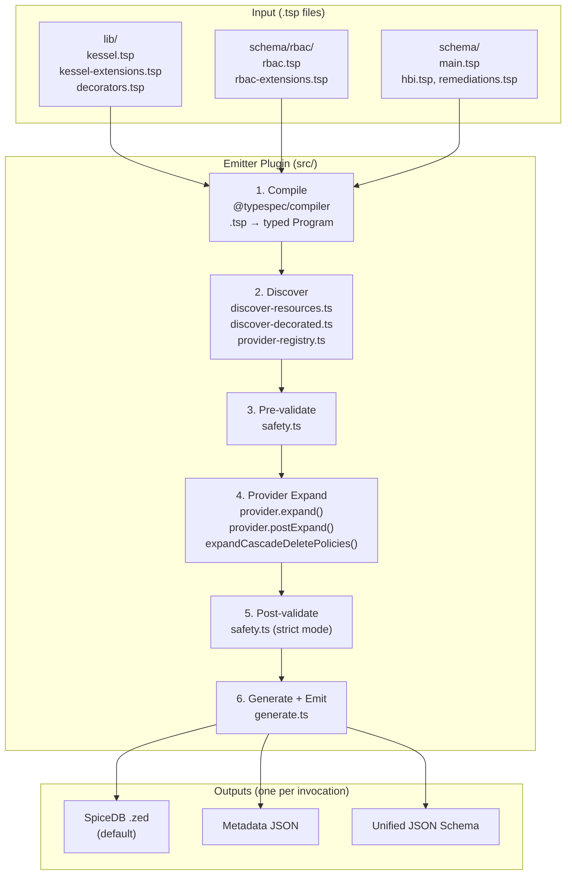

# TypeSpec-as-Schema POC

Prototype exploring [TypeSpec](https://typespec.io/) as a unified schema representation for Kessel (same RBAC + HBI benchmark as sibling POCs).

## How It Works

Service teams write `.tsp` files declaring resources and permissions. A registered TypeSpec emitter plugin (`$onEmit`) compiles them into SpiceDB schemas, metadata, and JSON Schema — no manual wiring needed.

```
 .tsp files                     src/ (emitter plugin)

┌──────────────┐         ┌──────────────────────┐
│ lib/         │         │  1. COMPILE           │
│  kessel.tsp  │         │  TypeSpec compiler    │
│  kessel-     │────┐    │  parses .tsp into     │
│  extensions  │    │    │  a typed Program      │
│  .tsp        │    │    └──────────┬───────────┘
│  decorators  │    │               │
│  .tsp        │    │    ┌──────────┴───────────┐
├──────────────┤    │    │  2. DISCOVER          │
│ schema/rbac/ │    │    │  Resources + V1 perms │
│  rbac.tsp    │────┤    │  + cascade policies   │         Outputs
│  rbac-ext    │    │    │  + annotations        │
│  .tsp        │    │    └──────────┬───────────┘  ┌────────────────────┐
├──────────────┤    │               │              │ SpiceDB .zed       │
│ schema/      │    │    ┌──────────┴───────────┐  │ (default)          │
│  main.tsp    │────┤    │  3. VALIDATE (pre)    │  ├────────────────────┤
│  hbi.tsp     │────┤    │  expression refs      │  │ Metadata JSON      │
│  remediations│    │    └──────────┬───────────┘  ├────────────────────┤
│  .tsp        │────┘               │              │ Unified JSON Schema│
└──────────────┘         ┌──────────┴───────────┐  └─────────▲──────────┘
                         │  4. EXPAND            │           │
                         │  RBAC: 7 mutations    │           │
                         │  Scaffold + Cascade   │           │
                         └──────────┬───────────┘           │
                                    │                       │
                         ┌──────────┴───────────┐           │
                         │  5. VALIDATE (post)   │           │
                         │  cross-type subrefs   │           │
                         └──────────┬───────────┘           │
                                    │                       │
                         ┌──────────┴───────────┐           │
                         │  6. GENERATE + EMIT   │───────────┘
                         │  (generate.ts)        │
                         └──────────────────────┘

  Emitter entry point: src/emitter.ts ($onEmit)
  Custom decorators: @cascadePolicy, @annotation (src/decorators.ts)
```

## Quick Start

```bash
npm install
npm run build                                                                   # compile TypeScript emitter

# Run via tsp compile (registered emitter plugin)
npx tsp compile schema/main.tsp                                                 # SpiceDB output (default)
npx tsp compile schema/main.tsp --option typespec-as-schema.output-format=metadata        # per-service metadata
npx tsp compile schema/main.tsp --option typespec-as-schema.output-format=unified-jsonschema  # JSON Schema

npx vitest run                                                                  # run tests
make demo                                                                       # all outputs in one console tour
```

## What Service Teams Write

A service team adds **one `.tsp` file** with two things:

**1. Register permissions** (one alias per permission):

```typespec
alias viewPermission = Kessel.V1WorkspacePermission<
  "inventory", "hosts", "read", "inventory_host_view"
>;
```

This single line triggers 7 mutations across Role, RoleBinding, and Workspace.

**2. Define the resource model:**

```typespec
model Host {
  workspace: Assignable<RBAC.Workspace, Cardinality.ExactlyOne>;
  view: Permission<SubRef<"workspace", "inventory_host_view">>;
  update: Permission<SubRef<"workspace", "inventory_host_update">>;
}
```

Then add one import to `schema/main.tsp`. Done. No TypeScript changes needed.

## Architecture



### Emitter Plugin Model

This project is a **registered TypeSpec emitter plugin** with custom decorators and a **provider registry**:

- **Provider registry** — `src/provider-registry.ts` defines `KesselProvider` interface. Providers self-register at module load time; the emitter loops over them for discovery, expansion, and metadata contribution. New providers require only new files + a side-effect import.
- **Shared template discovery** — `src/discover-templates.ts` centralizes all internal compiler API usage (AST walking, alias resolution). Providers declare *what* template they own; the platform handles *how* to find instances.
- **Custom decorators** — `@cascadePolicy` and `@annotation` (declared in `lib/decorators.tsp`, implemented in `src/decorators.ts`) tag models into compiler state sets for reliable discovery.
- **`$onEmit` entry point** — `src/emitter.ts` exports `$onEmit`, which the TypeSpec compiler calls after compilation. It orchestrates the full pipeline: discover → pre-validate → provider expand → cascade expand → post-validate → generate.
- **`$lib` registration** — `src/lib.ts` defines the emitter library with `createTypeSpecLibrary`, including emitter options (`output-format`, `strict`) and custom diagnostics.
- **Two-pass expression validation** — Permission expressions are validated both pre-expansion (catches typos before mutations) and post-expansion (catches cross-resource reference errors in the fully expanded graph).
- **Model templates as data carriers** — `V1WorkspacePermission`, `CascadeDeletePolicy`, and `ResourceAnnotation` are parameterized TypeSpec models that carry string parameters. Expansion logic is owned by providers (RBAC).

### The 7 Mutations Per Extension

When a service declares `V1WorkspacePermission<"inventory", "hosts", "read", "inventory_host_view">`, the expansion function adds:

| # | Target | What | Example |
|---|--------|------|---------|
| 1-4 | Role | 4 bool relations (hierarchy) | `inventory_any_any`, `inventory_hosts_any`, `inventory_any_read`, `inventory_hosts_read` |
| 5 | Role | Union permission | `inventory_host_view = any_any_any + inventory_any_any + ...` |
| 6 | RoleBinding | Intersection permission | `inventory_host_view = (subject & t_granted->inventory_host_view)` |
| 7 | Workspace | Union permission | `inventory_host_view = t_binding->... + t_parent->...` |

After all extensions, read-verb permissions are OR'd into `view_metadata` on Workspace.

## File Structure

```
lib/                             Platform types (shared .tsp)
  kessel.tsp                       Assignable, Permission, BoolRelation, Cardinality
  kessel-extensions.tsp            Platform templates: CascadeDeletePolicy, ResourceAnnotation
  decorators.tsp                   extern dec declarations: @cascadePolicy, @annotation

schema/                          Service schemas (teams own their files)
  main.tsp                         Entrypoint — imports all services
  hbi.tsp                          Host resource + V1 permission aliases + policies + annotations
  remediations.tsp                 Permissions-only service
  rbac/
    rbac.tsp                       Core RBAC types: Principal, Role, RoleBinding, Workspace
    rbac-extensions.tsp            RBAC extension template: V1WorkspacePermission

src/                             TypeSpec emitter plugin
  index.ts                         Package entry: exports $lib, $onEmit, decorators
  lib.ts                           Emitter library definition, state keys, barrel re-exports
  emitter.ts                       $onEmit — provider-registry-driven pipeline orchestrator
  types.ts                         Core interfaces: ResourceDef, RelationBody, ServiceMetadata
  primitives.ts                    Graph builders: ref, subref, or, and, addRelation, hasRelation
  utils.ts                         Shared helpers: bodyToZed, slotName, flattenAnnotations, etc.
  decorators.ts                    Decorator implementations: $cascadePolicy, $annotation
  discover-resources.ts            Resource graph extraction from the TypeSpec AST
  discover-templates.ts            Platform template discovery (AST walking, alias resolution)
  discover-decorated.ts            Decorator-state-based discovery (cascade, annotations)
  provider-registry.ts             KesselProvider interface + registerProvider / getProviders
  expand-cascade.ts                Platform cascade-delete expansion
  generate.ts                      Output generators: SpiceDB, metadata, JSON Schema
  safety.ts                        Pre/post-expansion permission expression validation
  providers/rbac/
    rbac-provider.ts               RBAC domain logic: expansion (7 mutations), scaffold

test/                            Tests (Vitest)
  unit/                            Pure unit tests per module (13 files)
  integration/                     Full pipeline integration tests
  helpers/
    pipeline.ts                    compilePipeline() — end-to-end test runner
    zed-parser.ts                  SpiceDB output parser
  fixtures/
    spicedb-reference.zed          Golden file for output comparison
```

## Output Formats

| Output | Option | Format | Audience |
|---|---|---|---|
| SpiceDB | *(default)* | Zed DSL | Authorization engine |
| Metadata | `output-format=metadata` | JSON | Platform tooling |
| Unified JSON Schema | `output-format=unified-jsonschema` | JSON Schema | API servers/clients |

## Documentation

See **[docs/Guide.md](docs/Guide.md)** — single end-to-end reference covering:

- Pipeline flow (compile → discover → expand → validate → emit)
- Service developer guide (add services, resources, permissions)
- Provider developer guide (build new expansion providers)
- Architecture, testing, and design decisions

## Risks and Tradeoffs

- **Node.js in CI** for `tsp` + TypeScript build
- **New extension providers** implement `KesselProvider` interface, use shared `discoverTemplateInstances()`, and self-register — no emitter edits beyond a side-effect import
- **Two JSON Schema paths** — built-in `@jsonSchema` emit vs unified schema (both run via `tspconfig.yaml`)
