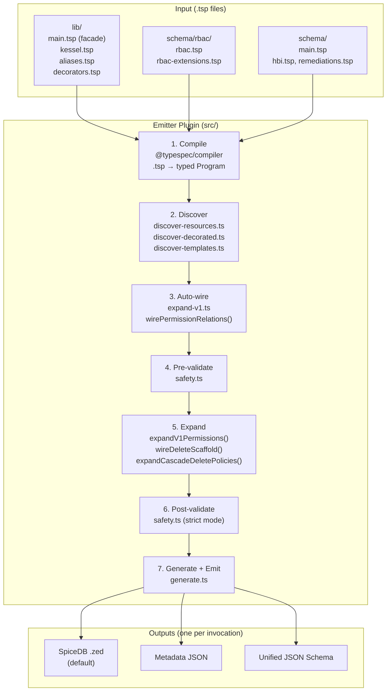

# TypeSpec-as-Schema POC

Prototype exploring [TypeSpec](https://typespec.io/) as a unified schema representation for Kessel (same RBAC + HBI benchmark as sibling POCs).

## How It Works

Service teams write `.tsp` files declaring resources and permissions. A registered TypeSpec emitter plugin (`$onEmit`) compiles them into SpiceDB schemas, metadata, and JSON Schema — no manual wiring needed.

```
 .tsp files                     src/ (emitter plugin)

┌──────────────┐         ┌──────────────────────┐
│ lib/         │         │  1. COMPILE           │
│  main.tsp    │         │  TypeSpec compiler    │
│  kessel.tsp  │────┐    │  parses .tsp into     │
│  aliases.tsp │    │    │  a typed Program      │
│  decorators  │    │    └──────────┬───────────┘
│  .tsp        │    │               │
├──────────────┤    │    ┌──────────┴───────────┐
│ schema/rbac/ │    │    │  2. DISCOVER          │
│  rbac.tsp    │────┤    │  Resources + V1 perms │
│  rbac-ext    │    │    │  + cascade policies   │         Outputs
│  .tsp        │    │    │  + annotations        │
├──────────────┤    │    └──────────┬───────────┘  ┌────────────────────┐
│ schema/      │    │               │              │ SpiceDB .zed       │
│  main.tsp    │────┤    ┌──────────┴───────────┐  │ (default)          │
│  hbi.tsp     │────┤    │  3. AUTO-WIRE + VALID │  ├────────────────────┤
│  remediations│    │    │  Permission relations  │  │ Metadata JSON      │
│  .tsp        │────┘    │  + expression refs     │  ├────────────────────┤
└──────────────┘         └──────────┬───────────┘  │ Unified JSON Schema│
                                    │              └─────────▲──────────┘
                         ┌──────────┴───────────┐           │
                         │  4. EXPAND            │           │
                         │  V1: 7 mutations/perm │           │
                         │  Scaffold + Cascade   │           │
                         └──────────┬───────────┘           │
                                    │                       │
                         ┌──────────┴───────────┐           │
                         │  5. VALIDATE (post)   │           │
                         │  cross-type subrefs   │           │
                         └──────────┬───────────┘           │
                                    │                       │
                         ┌──────────┴───────────┐           │
                         │  6. GENERATE + EMIT   │───────────┘
                         │  (generate.ts)        │
                         └──────────────────────┘

  Emitter entry point: src/emitter.ts ($onEmit)
  V1 expansion:        src/expand-v1.ts
  Custom decorators:   @v1Permission, @cascadeDelete, @resourceAnnotation (src/decorators.ts)
```

## Quick Start

```bash
npm install
npm run build                                                                   # compile TypeScript emitter

# Run via tsp compile (registered emitter plugin)
npx tsp compile schema/main.tsp                                                 # SpiceDB output (default)
npx tsp compile schema/main.tsp --option typespec-as-schema.output-format=metadata        # per-service metadata
npx tsp compile schema/main.tsp --option typespec-as-schema.output-format=unified-jsonschema  # JSON Schema

npx vitest run                                                                  # run tests
make demo                                                                       # all outputs in one console tour
```

## What Service Teams Write

A service team adds **one `.tsp` file** with two things:

**1. Register permissions** (decorators on a model):

```typespec
@v1Permission("inventory", "hosts", "read", "inventory_host_view")
@v1Permission("inventory", "hosts", "write", "inventory_host_update")
model Host {
  workspace: WorkspaceRef;
}
```

Each `@v1Permission` triggers 7 mutations across Role, RoleBinding, and Workspace, and auto-wires the corresponding relation on the resource model (`read` → `view`, `write` → `update`).

**2. Import the facade and register in main.tsp:**

```typespec
import "../lib/main.tsp";  // single import brings in all Kessel types + RBAC
using Kessel;
```

Then add one import to `schema/main.tsp`. Done. No TypeScript changes needed.

## Architecture

The emitter calls expansion functions directly — no provider registry or abstraction layer.



### Key Design Points

- **Direct pipeline** — `src/emitter.ts` calls `expandV1Permissions()`, `wireDeleteScaffold()`, and `expandCascadeDeletePolicies()` directly. No registry indirection.
- **Auto-wired relations** — `@v1Permission` decorators trigger automatic injection of permission relations (`view`, `update`, etc.) on resource models, eliminating manual duplication.
- **Single-import facade** — `lib/main.tsp` imports all core types, RBAC types, decorators, and aliases. Service schemas need only `import "../lib/main.tsp";`.
- **Pre-composed aliases** — `WorkspaceRef` replaces `Assignable<RBAC.Workspace, Cardinality.ExactlyOne>`.
- **Custom decorators** — `@v1Permission`, `@cascadeDelete`, and `@resourceAnnotation` (declared in `lib/decorators.tsp`, implemented in `src/decorators.ts`) tag models into compiler state maps for reliable discovery.
- **Two-pass expression validation** — Permission expressions are validated both pre-expansion (catches typos before mutations) and post-expansion (catches cross-resource reference errors in the fully expanded graph).

### The 7 Mutations Per Permission

When a service declares `@v1Permission("inventory", "hosts", "read", "inventory_host_view")`, the expansion function adds:

| # | Target | What | Example |
|---|--------|------|---------|
| 1-4 | Role | 4 bool relations (hierarchy) | `inventory_any_any`, `inventory_hosts_any`, `inventory_any_read`, `inventory_hosts_read` |
| 5 | Role | Union permission | `inventory_host_view = any_any_any + inventory_any_any + ...` |
| 6 | RoleBinding | Intersection permission | `inventory_host_view = (subject & t_granted->inventory_host_view)` |
| 7 | Workspace | Union permission | `inventory_host_view = t_binding->... + t_parent->...` |

After all extensions, read-verb permissions are OR'd into `view_metadata` on Workspace.

## File Structure

```
lib/                             Platform types (shared .tsp)
  main.tsp                        Single-import facade
  kessel.tsp                      Assignable, Permission, BoolRelation, Cardinality
  kessel-extensions.tsp            Platform templates: CascadeDeletePolicy, ResourceAnnotation
  aliases.tsp                      Pre-composed aliases: WorkspaceRef
  decorators.tsp                   extern dec declarations: @v1Permission, @cascadeDelete, @resourceAnnotation

schema/                          Service schemas (teams own their files)
  main.tsp                         Entrypoint — imports lib/main.tsp + all services
  hbi.tsp                          Host resource + V1 permissions + policies + annotations
  remediations.tsp                 Permissions-only service
  rbac/
    rbac.tsp                       Core RBAC types: Principal, Role, RoleBinding, Workspace
    rbac-extensions.tsp            V1WorkspacePermission template (type definition)

src/                             TypeSpec emitter plugin
  index.ts                         Package entry: exports $lib, $onEmit, decorators
  lib.ts                           Emitter library definition, state keys, barrel re-exports
  emitter.ts                       $onEmit — direct pipeline orchestrator
  expand-v1.ts                     V1 expansion (7 mutations), delete scaffold, auto-wiring
  types.ts                         Core interfaces: ResourceDef, RelationBody, ServiceMetadata
  primitives.ts                    Graph builders: ref, subref, or, and, addRelation, hasRelation
  resource-graph.ts                Mutation-friendly wrapper over ResourceDef[]
  utils.ts                         Shared helpers: bodyToZed, slotName, flattenAnnotations, etc.
  decorators.ts                    Decorator implementations: $v1Permission, $cascadeDelete, $resourceAnnotation
  discover-resources.ts            Resource graph extraction from the TypeSpec AST
  discover-templates.ts            Platform template discovery (AST walking, alias resolution)
  discover-decorated.ts            Decorator-state-based discovery (cascade, annotations)
  expand-cascade.ts                Platform cascade-delete expansion
  generate.ts                      Output generators: SpiceDB, metadata, JSON Schema
  safety.ts                        Pre/post-expansion permission expression validation

test/                            Tests (Vitest)
  unit/                            Pure unit tests per module
  integration/                     Full pipeline integration tests
  helpers/
    pipeline.ts                    compilePipeline() — end-to-end test runner
    zed-parser.ts                  SpiceDB output parser
  fixtures/
    spicedb-reference.zed          Golden file for output comparison
```

## Output Formats

| Output | Option | Format | Audience |
|---|---|---|---|
| SpiceDB | *(default)* | Zed DSL | Authorization engine |
| Metadata | `output-format=metadata` | JSON | Platform tooling |
| Unified JSON Schema | `output-format=unified-jsonschema` | JSON Schema | API servers/clients |

## Documentation

See **[docs/Guide.md](docs/Guide.md)** — single end-to-end reference covering:

- Pipeline flow (compile → discover → auto-wire → expand → validate → emit)
- Service developer guide (add services, resources, permissions)
- Architecture, testing, and design decisions

## Risks and Tradeoffs

- **Node.js in CI** for `tsp` + TypeScript build
- **New expansion logic** is added directly to `src/expand-*.ts` and called from `src/emitter.ts` — no separate plugin model
- **Two JSON Schema paths** — built-in `@jsonSchema` emit vs unified schema (both run via `tspconfig.yaml`)
