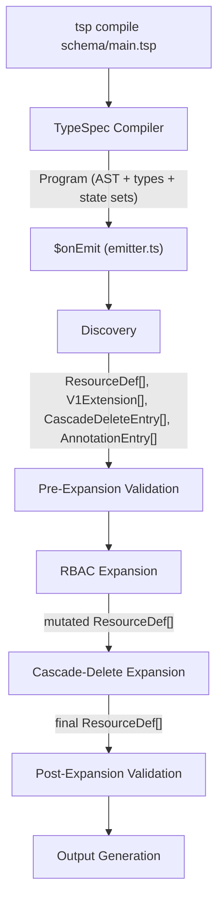
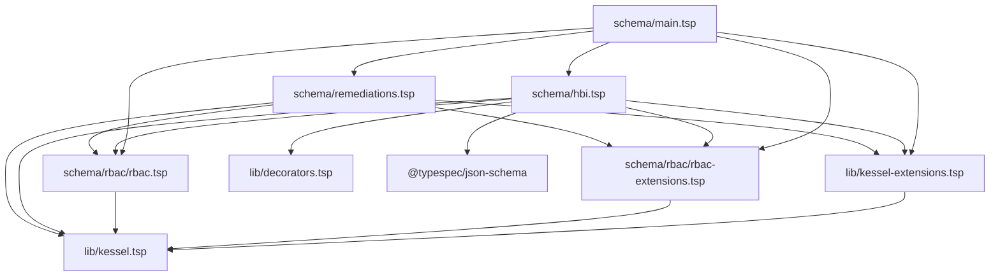
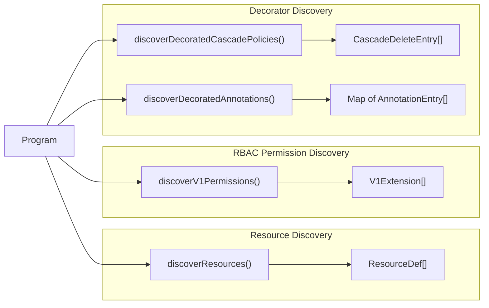
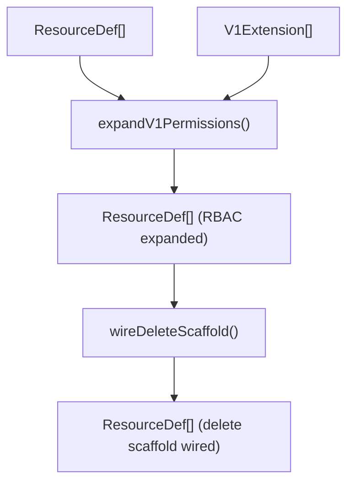
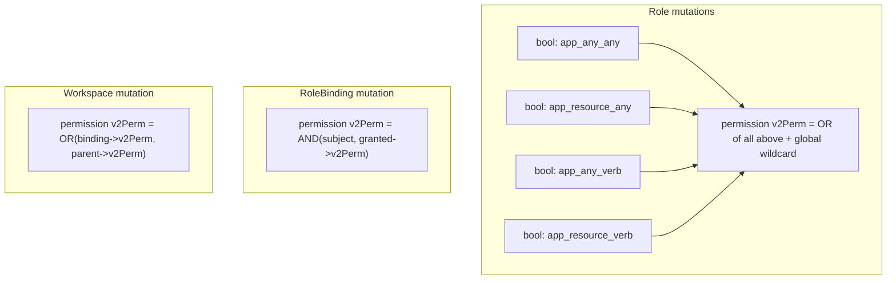
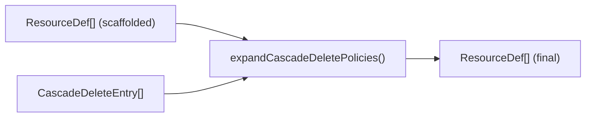
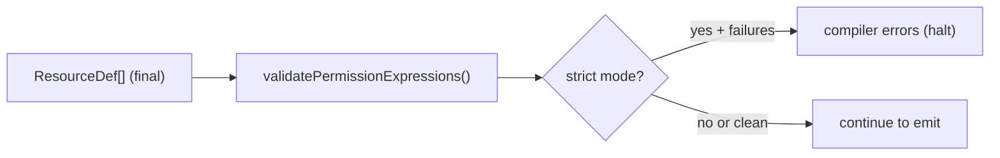
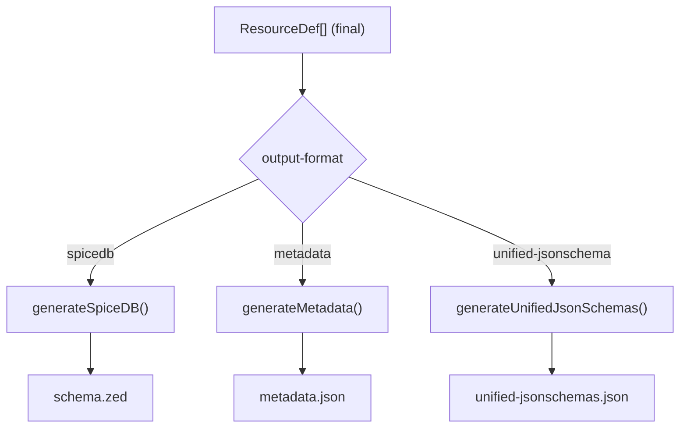
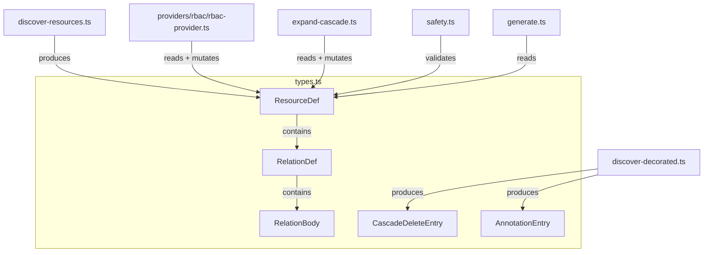
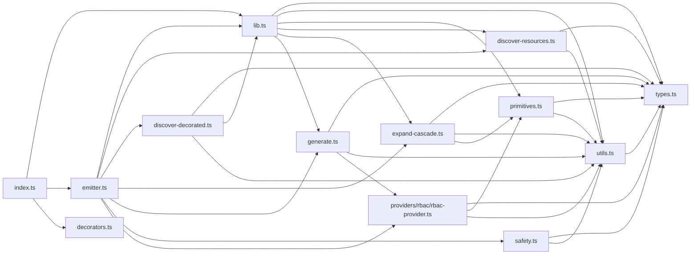

# Code Flow: TypeSpec Emitter Pipeline

This document traces the full code flow from `tsp compile` invocation through to file output, using diagrams to illustrate data movement and module responsibilities.

For deeper coverage of types, interfaces, and the DSL surface, see [Architecture-Guide.md](./Architecture-Guide.md).

---

## High-Level Pipeline



---

## Phase 1: Compilation

The TypeSpec compiler resolves the import graph rooted at `schema/main.tsp`, parses all `.tsp` files into a typed `Program` (AST + resolved type graph), and runs decorator implementations that populate compiler state sets.



**Outputs:** A `Program` object containing the resolved type graph and state sets populated by `@cascadePolicy` and `@annotation` decorators.

---

## Phase 2: Discovery

Four independent discovery paths extract structured data from the compiled `Program`:



### Resource Discovery (`discover-resources.ts`)

Walks all models in the program via `navigateProgram`. For each model with `Assignable`, `BoolRelation`, or `Permission` properties, emits a `ResourceDef` with relations. Skips models in the `Kessel` namespace and extension template instances.

### RBAC Permission Discovery (`rbac-provider.ts`)

Finds the `V1WorkspacePermission` template model in namespace `Kessel`, then walks all models that are template instances of it. Also resolves top-level `alias` statements via `program.checker.getTypeForNode` to catch alias-based instantiations. Extracts `(application, resource, verb, v2Perm)` tuples.

### Decorator Discovery (`discover-decorated.ts`)

Reads `program.stateSet(StateKeys.cascadePolicy)` and `program.stateSet(StateKeys.annotation)` — populated by the `@cascadePolicy` and `@annotation` decorator implementations in `src/decorators.ts`. Extracts structured entries with de-duplication.

---

## Phase 3: Pre-Expansion Validation


Checks that every `ref` and `subref` in permission expressions resolves to a known local relation name **before** expansion mutates the graph. Failures produce warnings (not errors) since providers will add missing relations.

**File:** `src/safety.ts`

---

## Phase 4: RBAC Expansion

Two sequential operations mutate the resource graph:



### expandV1Permissions — 7 mutations per permission

For each `V1Extension { application, resource, verb, v2Perm }`:



Additionally, all read-verb permissions accumulate into a `view_metadata` permission on Workspace.

### wireDeleteScaffold

Adds `delete` permissions to Role, RoleBinding, and Workspace if not already present, creating the RBAC cascade-delete chain.

**File:** `src/providers/rbac/rbac-provider.ts`

---

## Phase 5: Cascade-Delete Expansion



For each `CascadeDeleteEntry`, finds the child resource and adds a `delete` permission as `subref(parentRelation_slot, "delete")`. Requires the RBAC delete scaffold to already exist on Role/RoleBinding/Workspace.

**File:** `src/expand-cascade.ts`

---

## Phase 6: Post-Expansion Validation



Cross-type validation on the fully expanded graph. Verifies that `subref` targets actually expose the referenced sub-relation on the target type. In strict mode, failures become compiler errors.

**File:** `src/safety.ts`

---

## Phase 7: Output Generation

The `output-format` option selects which generator runs:



**File:** `src/generate.ts`

---

## Data Flow Summary

Key data structures and how they flow between modules:



---

## Module Dependency Graph

Import relationships between `src/` modules:



---

## Invocation

```bash
# Build the TypeScript emitter
npx tsc -p tsconfig.build.json

# Run the pipeline (choose one output-format)
npx tsp compile schema/main.tsp --option typespec-as-schema.output-format=spicedb
npx tsp compile schema/main.tsp --option typespec-as-schema.output-format=metadata
npx tsp compile schema/main.tsp --option typespec-as-schema.output-format=unified-jsonschema
```

The `strict` flag promotes post-expansion validation failures to errors:

```bash
npx tsp compile schema/main.tsp --option typespec-as-schema.output-format=spicedb --option typespec-as-schema.strict=true
```
