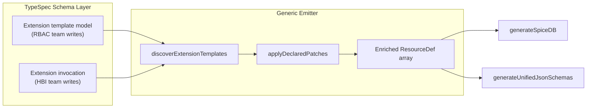
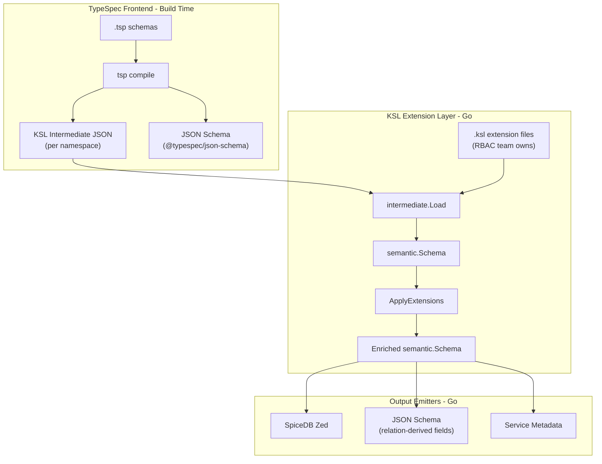

# Extension Decoupling Design: TypeSpec Emitter

**Status**: Prototype  
**Context**: [Schema-Unification-Key-Questions.md](Schema-Unification-Key-Questions.md) Q2/Q3  

## Problem

In the TypeSpec POC, `V1BasedPermission` in `rbac.tsp` is a marker model -- it carries four string parameters but no behavior. The actual expansion logic (what relations to add to `role`, `role_binding`, `workspace`) is hardcoded in `emitter/lib.ts` `buildSchemaFromTypeGraph()`. Adding a new extension pattern requires modifying TypeScript emitter code.

In CUE and KSL, extension definitions live at the schema layer and emitters are generic visitors with no extension awareness.

This document designs two solutions and compares them.

## Option A: Declarative Extension Templates in TypeSpec

### Architecture



### Design

Replace the hardcoded `buildSchemaFromTypeGraph` with a generic patch applicator that reads structured patch declarations from TypeSpec models.

The RBAC team defines an `ExtensionTemplate` model where patch rules are expressed as structured TypeSpec properties:

```typespec
model V1WorkspacePermission<App extends string, Res extends string, Verb extends string, V2 extends string> {
  application: App;
  resource: Res;
  verb: Verb;
  v2Perm: V2;

  role_boolRelations: "${App}_any_any,${App}_${Res}_any,${App}_any_${Verb},${App}_${Res}_${Verb}";
  role_permission: "${V2}=any_any_any|${App}_any_any|${App}_${Res}_any|${App}_any_${Verb}|${App}_${Res}_${Verb}";
  roleBinding_permission: "${V2}=subject&granted->${V2}";
  workspace_permission: "${V2}=binding->${V2}|parent->${V2}";
}
```

The emitter:
1. Discovers template instances (same as today's `findV1PermissionTemplate`)
2. Reads the `*_boolRelations`, `*_permission` properties as **patch declarations**
3. Interpolates string type parameters into the declarations
4. Applies patches generically to the target resources

### Tradeoffs

**Strengths:**
- RBAC team owns the full extension definition in `.tsp` -- no emitter changes for new patterns
- IDE support for authoring (TypeSpec IntelliSense on the template model)
- Single language, single compilation step

**Weaknesses:**
- TypeSpec can't enforce patch semantics at compile time -- the patch DSL is convention
- String interpolation is emitter-side (TypeSpec string literal types don't support runtime interpolation)
- Extension expansion still lives in Node.js; Go consumers receive post-expansion output
- Does not solve Q1 (Go-native in-memory model) or Q3 (JSON Schema reflection of extensions through a shared model)

---

## Option B: TypeSpec Frontend + KSL Extension Layer

### Architecture



### Design

New emitter mode `--ksl-ir` translates TypeSpec's `ResourceDef[]` into KSL's `intermediate.Namespace` JSON format. The Go side uses KSL's existing `Load` -> `ToSemantic` -> `ApplyExtensions` pipeline.

**Translation mapping:**

| TypeSpec concept | KSL IR equivalent |
|-----------------|-------------------|
| `ResourceDef.namespace` | `Namespace.name` |
| `ResourceDef.name` | `Type.name` |
| `RelationBody.kind: "assignable"` | `RelationBody.kind: "self"` + `types` array + `cardinality` |
| `RelationBody.kind: "bool"` | `RelationBody.kind: "self"` + `types[{all: true}]` + `cardinality: "All"` |
| `RelationBody.kind: "ref"` | `RelationBody.kind: "reference"` + `relation` |
| `RelationBody.kind: "subref"` | `RelationBody.kind: "nested_reference"` + `relation` + `sub_relation` |
| `RelationBody.kind: "or"` (n-ary) | Binary `union` tree (fold left) |
| `RelationBody.kind: "and"` (n-ary) | Binary `intersect` tree (fold left) |
| `V1Extension` alias | `ExtensionReference` on the relation |

**What stays in TypeSpec:** Data modeling, JSON Schema output, resource type declarations.  
**What moves to KSL:** Extension definitions, extension expansion, SpiceDB generation.

### Tradeoffs

**Strengths:**
- Full decoupling: RBAC team writes extensions in KSL, HBI team writes data models in TypeSpec
- Extensions patch the Go semantic model; all Go-side emitters see the enriched model
- Solves Q3: extension-generated writable relations appear in JSON Schema
- Go-native model at runtime (no Node.js dependency after build)
- Leverages existing tested code on both sides

**Weaknesses:**
- Two languages (TypeSpec for data, KSL for authorization extensions)
- Build pipeline requires both Node.js and Go
- Data fields from TypeSpec need a separate reconciliation path to reach KSL's `Field` system

---

## Recommendation

Start with **Option B**. It solves all three original questions (Go-native model, extension decoupling, JSON Schema reflection) without inventing new abstractions. Both sides already have working code -- the work is primarily a translation layer.

Build **Option A** as a comparison point to show what pure-TypeSpec looks like.

## Comparison

Both POCs are implemented and tested. All 128 tests pass (88 original + 12 KSL IR unit + 9 KSL IR integration + 19 declarative equivalence).

### Quantitative Metrics

| Metric | Current (hardcoded) | Option A (declarative) | Option B (KSL IR bridge) |
|--------|-------------------|----------------------|------------------------|
| Extension definition | `buildSchemaFromTypeGraph` in `emitter/lib.ts` (102 LOC, TypeScript) | `lib/kessel-extensions.tsp` (52 LOC, TypeSpec) | `samples/rbac.ksl` (existing, KSL) |
| Generic infrastructure | N/A (hardcoded) | `emitter/declarative-extensions.ts` (240 LOC, written once) | `emitter/ksl-ir-emitter.ts` (262 LOC, written once) |
| Files changed for new extension pattern | `emitter/lib.ts` (emitter code) | `lib/kessel-extensions.tsp` (TypeSpec only) | `.ksl` file (KSL only) |
| Extension owner touches emitter? | Yes | No | No |
| Language for extensions | TypeScript | TypeSpec string-literal DSL | KSL |
| Runtime dependency | Node.js | Node.js | Go (after build) |
| Go-native model at runtime | No | No | Yes |
| Extension-generated fields in JSON Schema | No (emitter-side only) | No (same limitation) | Yes (via KSL semantic model) |

### Qualitative Comparison

**What each approach moves to the schema layer:**

| Concern | Current | Option A | Option B |
|---------|---------|----------|----------|
| Extension definition (what patches to apply) | Emitter TypeScript | TypeSpec template model | KSL extension definition |
| Extension invocation (which service applies it) | TypeSpec alias | TypeSpec alias (same) | TypeSpec alias → KSL IR reference |
| Extension expansion (interpreting patches) | Hardcoded in emitter | Generic emitter parser | KSL `ApplyExtensions()` in Go |
| Output emission (SpiceDB, JSON Schema) | Same emitter | Same emitter | KSL Go emitters |

**Adding a new extension pattern (e.g. `add_custom_role_hierarchy`):**

- **Current**: Write new TypeScript expansion logic in `buildSchemaFromTypeGraph`. Requires emitter expertise.
- **Option A**: Define a new TypeSpec template model with patch-rule properties. The generic `applyDeclaredPatches()` reads and applies them without code changes. Requires understanding the patch-rule DSL convention.
- **Option B**: Define a new `.ksl` extension file. KSL's existing `ApplyExtensions()` handles it. Requires KSL expertise.

### Key Differences

1. **Q1 (Go-native model)**: Only Option B provides a Go-native in-memory model. Option A still requires Node.js at runtime.

2. **Q3 (JSON Schema reflection)**: Only Option B can reflect extension-generated writable relations in JSON Schema, because extensions patch the shared semantic model that all emitters (including JSON Schema) consume. Option A's extensions enrich the `ResourceDef[]` array, but this happens in a Node.js pipeline that doesn't feed back into TypeSpec's `@jsonSchema` emitter.

3. **Single-language simplicity**: Option A keeps everything in TypeSpec + TypeScript. Option B requires two languages (TypeSpec for data models, KSL for authorization).

4. **Compile-time safety**: Option A's patch rules are string-literal conventions — the TypeSpec compiler can't validate them. Option B's `.ksl` files are parsed and validated by the KSL compiler.

### Recommendation (unchanged)

**Option B** is the stronger solution for the schema-unify use case. It solves all three original questions and leverages existing, tested infrastructure on both sides. The two-language cost is justified by the architectural benefits: full decoupling, Go-native models, and JSON Schema reflection.

**Option A** is useful as a fallback for teams that want to stay within a single TypeSpec compilation step, accepting that extension-generated fields won't appear in JSON Schema and Go consumers need Node.js in their build pipeline.
