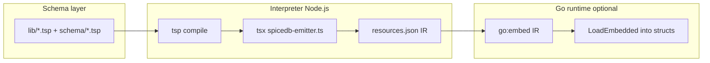

# Service schema authoring, interpreter separation, and Go consumption

**Purpose:** Answer how service developers express schema, how that becomes an in-memory artifact consumable by something like Inventory, whether extension logic can decouple from SpiceDB formatting, and how JSON Schema stays aligned with writable relations—using the **TypeSpec POC** as the primary example and contrasting other POCs where useful.

---

## 1. What do service developers write?

### TypeSpec POC (`poc/typespec-as-schema`)

Evaluation layout intentionally splits **platform vocabulary** from **adopter schema**:

| Layer | Location | Who writes what |
|-------|----------|-----------------|
| **Schema (authoring)** | [`schema/`](../../poc/typespec-as-schema/schema/) | Service teams: `namespace`, resource `model`s (`Host`, …), `@jsonSchema` data models, `Assignable` / `Permission` wiring, and **aliases** that instantiate `Kessel.V1WorkspacePermission<application, resource, verb, v2Perm>` from [`lib/kessel-extensions.tsp`](../../poc/typespec-as-schema/lib/kessel-extensions.tsp). |
| **Platform library** | [`lib/`](../../poc/typespec-as-schema/lib/) | RBAC / platform: `kessel.tsp` (Assignable, Permission, …), `kessel-extensions.tsp` (template + **declarative patch strings**). |
| **Interpreter / tooling** | [`src/`](../../poc/typespec-as-schema/src/) | Not service-authored: TypeScript that compiles the TypeSpec program, discovers resources and extensions, **applies patches**, and emits SpiceDB, IR, metadata, unified JSON Schema, etc. |

So in the benchmark, a service developer’s “part of the schema” is **mostly under `schema/`**: they import `lib/`, declare resources and data, and register permissions via **`V1WorkspacePermission` aliases**. They do **not** edit `src/spicedb-emitter.ts` for the standard extension pattern.

### Other POCs (one line each)

- **ts-as-schema:** TypeScript under `schema/` + shared model in `src/model/`; Go loads compiled JS.
- **Starlark:** `.star` modules under `schema/`; Go interpreter + visitors.
- **CUE internal DSL:** `.cue` under `internal_dsl/`; Go interpreter walks unified CUE values.
- **KSL:** `.ksl` files; compiler produces a Go-friendly semantic model.

---

## 2. How do we get from that to an in-memory model “in Inventory”?

Two different meanings of **inventory** matter:

### A) Inventory as the **HBI / `Inventory` namespace** (authoring)

The service author writes [`schema/hbi.tsp`](../../poc/typespec-as-schema/schema/hbi.tsp) (namespace `Inventory`, model `Host`, permissions, data). That file is **source text**. It does not, by itself, become a struct inside a running Inventory microservice until some **pipeline** runs.

### B) Inventory (or any Go service) consuming **a materialized schema snapshot**

In the TypeSpec POC, the path to a **Go in-memory struct** is **build-time Node → JSON IR → Go load**, not “parse `.tsp` in Go at runtime”:

Concrete steps:

1. **`tsp compile schema/main.tsp`** — TypeSpec builds a typed **Program** (in the Node/TS process).
2. **`src/spicedb-emitter.ts`** (and helpers) — `compileAndDiscover` → `discoverResources` → **`expandSchemaWithExtensions`** ([`pipeline.ts`](../../poc/typespec-as-schema/src/pipeline.ts) + [`declarative-extensions.ts`](../../poc/typespec-as-schema/src/declarative-extensions.ts)) → enriched **`ResourceDef[]`** plus JSON-Schema-oriented extras.
3. **`--ir`** — serializes **`IntermediateRepresentation`** (resources, extensions, precomputed SpiceDB string, metadata, unified JSON schemas) to e.g. [`go-consumer/schema/resources.json`](../../poc/typespec-as-schema/go-consumer/schema/resources.json).
4. **Go** — [`go-consumer`](../../poc/typespec-as-schema/go-consumer/) uses **`//go:embed`** and loads that JSON into Go types (see [go-consumer README](../../poc/typespec-as-schema/go-consumer/README.md)).

So the **in-memory model available to Go** is the **IR**, not the live TypeSpec compiler graph. Anything Inventory needs at runtime must either be **in that IR** or **re-derived in Go** from IR fields.

---

## 3. Limitations of loading into a Go program (TypeSpec POC)

- **No native TypeSpec in Go** — You do not get `@typespec/compiler` in-process. Runtime is **IR (or custom export) only**, unless you shell out to Node or add a new native front-end.
- **Build-time dependency on Node** — Generating or refreshing IR requires `npm` + `tsp` + `tsx` (see POC README). CI for schema changes must include that toolchain unless IR is committed and treated as an artifact.
- **IR version coupling** — The embedded JSON has a **`version`** field (e.g. `1.1.0` after recent changes). Go code must stay compatible or migrate when the IR shape changes.
- **Two JSON Schema stories** — TypeSpec’s **built-in** JSON Schema emitter writes under `tsp-output/` from `@jsonSchema` models. The POC’s **“unified”** JSON Schema (relation `_id` fields + extension `jsonSchema_addField`) is a **separate** path in [`lib.ts`](../../poc/typespec-as-schema/src/lib.ts). Consumers must know which artifact they need for validation.
- **Strict vs lenient extension parsing** — Default **strict** mode throws on bad patch strings; **`--lenient-extensions`** relaxes that. Go never sees that choice—it only sees **successful** emitted IR.

KSL and CUE POCs differ mainly in **where** the semantic model lives (Go compiler vs Go visitor over CUE) and whether the **same** structure backs all emitters without a Node hop.

---

## 4. Can we separate extension logic from output formatting?

### What is already separated in the TypeSpec POC

After discovery, **extension expansion** produces an enriched **`ResourceDef[]`** (and JSON-schema field rules). **Emitters** then project that graph:

- **`generateSpiceDB(fullSchema)`**
- **`generateUnifiedJsonSchemas(fullSchema, jsonSchemaFields)`**
- **`generateMetadata`**, **`generateIR`**, etc.

So **one expanded graph** feeds multiple outputs—the SpiceDB emitter is not the only consumer of expanded state.

### What is *not* fully decoupled

1. **Patch DSL + applicator are still TypeScript** — [`declarative-extensions.ts`](../../poc/typespec-as-schema/src/declarative-extensions.ts) parses **string** rules from the template. That is “extension logic” in the interpreter, not in TypeSpec’s type checker. RBAC can define **`V1WorkspacePermission`** and its patch properties in `.tsp`, but **new patch *kinds*** (new syntax) still require `src/` changes.

2. **`ResourceDef` is shaped for authorization projection** — Relations are modeled in a form that maps cleanly to SpiceDB-style names and bodies. That is a **pragmatic** intermediate representation, not a fully neutral “domain model” independent of Zanzibar/SpiceDB vocabulary.

3. **`jsonSchema_addField` is an output-oriented patch** — It declares **extra JSON Schema fields** explicitly, rather than deriving every column from a single abstract “writable relation” model (see §5).

So: **RBAC can ship an `add_v1_workspace_permission`-style extension that does not require editing `generateSpiceDB` line-by-line**, as long as the effect is expressible in the **existing declarative patch vocabulary**. True independence—**extension package with zero coupling to relation naming or SpiceDB**—would need a **more abstract internal model** and emitters that are pure **visitors** over that model (closer to the KSL / CUE story in [Extension-Decoupling-Design](../../poc/typespec-as-schema/docs/Extension-Decoupling-Design.md)).

---

## 5. Writable relationships, JSON Schema, and “patch the model” vs “patch the format”

### What the benchmark does today

- Extensions add **bool relations and permissions** to **`rbac/role`**, **`rbac/role_binding`**, **`rbac/workspace`** (SpiceDB-relevant structure).
- **`generateUnifiedJsonSchemas`** **skips** `namespace === "rbac"` for unified host-style payloads; it focuses on **service resources** (e.g. `inventory/host`) and adds:
  - **`_id` fields** from `ExactlyOne` assignable relations, and
  - **Extension-declared fields** via `jsonSchema_addField`, now **scoped** by `application` / `resource` (see POC README and [`lib.ts`](../../poc/typespec-as-schema/src/lib.ts)).

So **new writable bool slots on `role`** affect **SpiceDB** and the **internal `ResourceDef` for `rbac/role`**, but they do **not** automatically appear in a **unified JSON Schema document for “role”**—because that document is not the POC’s target for RBAC payloads.

### The user’s question: one extension, all surfaces

Ideally, **one extension** would **patch a single semantic model** (“role gains these writable relations”) and **every** emitter (SpiceDB, JSON Schema for the relevant API surface, inventory validation, …) would **derive** from that model.

In the TypeSpec POC:

- **Partial answer:** The **same** expanded `ResourceDef[]` drives SpiceDB text and IR **`resources`**. JSON Schema for **service** resources is merged from **relation-derived** fields + **explicit** `jsonSchema_addField` rules.
- **Gap:** There is **no** general rule “every new `BoolRelation` on role automatically becomes a property in *some* JSON Schema.” That would require either:
  - **Targeting RBAC** in `generateUnifiedJsonSchemas` (new product decision), or
  - A **neutral** “API / persistence schema” layer that lists writable fields for each resource type, maintained by extensions, with emitters as pure views.

**Patch-the-model vs patch-the-format:** Declarative patches today are closer to **enriching a graph tuned for authorization emission**, plus **explicit** JSON Schema side effects (`jsonSchema_addField`). They are **not** arbitrary AST rewrites of TypeSpec source. A **true** model-level patch would be something like: extensions mutate a **canonical semantic graph**, and JSON Schema and SpiceDB are **only** serializers—closer to **KSL `ApplyExtensions()`** in Go than to string templates in TypeSpec.

---

## 6. Schema vs interpreter: evaluation lens and forced separation

The TypeSpec POC **forces** a folder split for evaluators:

- **`schema/` + `lib/`** = what authors and platform owners edit.
- **`src/`** = tooling that gives meaning to library templates and walks the compiler graph.

That separation **helps comparison** with other POCs (same “where do I write?” question) but **surfaces challenges**:

| Challenge | Why it shows up |
|-----------|------------------|
| **Two runtimes** | `tsp compile` and `tsx src/spicedb-emitter.ts` (Makefile hides this, but CI and mental model do not). |
| **Semantics outside the checker** | Patch strings in `kessel-extensions.tsp` are not validated by TypeSpec; **strict** runtime checks in TS close part of the gap. |
| **Dual JSON Schema paths** | Built-in `@jsonSchema` emit vs custom “unified” schema—reviewers must know which is authoritative for which use case. |
| **Go story is IR, not source** | “Load schema in Inventory” means **embed IR** or regenerate in CI, not “import `.tsp` in Go.” |

The forced **schema / interpreter** boundary is **good for evaluation** (clear ownership, matches `ts-as-schema`’s `schema/` vs runtime story) but **highlights** that **TypeSpec is the carrier language**, while **Kessel-specific semantics** still live largely in **`src/`**—the central tension described in [poc/typespec-as-schema/docs/Extension-Decoupling-Design.md](../../poc/typespec-as-schema/docs/Extension-Decoupling-Design.md).

---

## 7. Summary table (TypeSpec POC)

| Question | Short answer |
|----------|----------------|
| What do service devs write? | Primarily `schema/*.tsp`: resources, data, `V1WorkspacePermission` aliases; platform in `lib/`. |
| In-memory model in Go? | **IR JSON** embedded or loaded at runtime; produced by Node emitter from expanded `ResourceDef[]`. |
| Go limitations? | No `.tsp` in Go; Node at build time; IR versioning; unified vs `tsp-output` JSON Schema. |
| Extension decoupled from SpiceDB? | **Partially:** same expanded graph feeds multiple emitters; patch **kinds** and **ResourceDef** shape still tie to TS and Zanzibar-style projection. |
| Writable rels → JSON Schema for role? | **Not automatic** in unified JSON Schema (RBAC skipped); service resources use relation `_id` + explicit `jsonSchema_addField`. True model-level patching favors languages with one semantic graph (e.g. KSL). |

---

*This document reflects the repository layout and POC behavior as of the unified JSON Schema scoping and strict extension parsing work in `poc/typespec-as-schema`; update cross-links if paths or IR versions change.*
