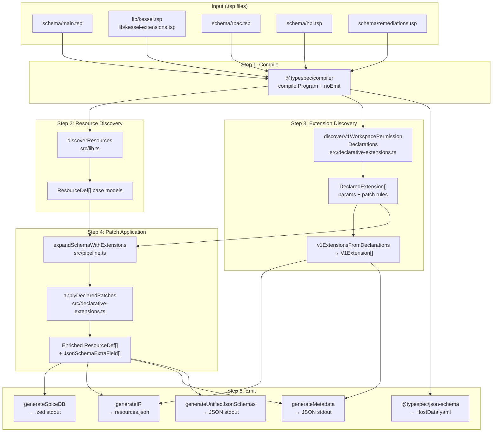
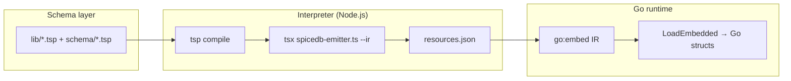

# TypeSpec-as-Schema: Design Document

**Audience:** RBAC platform, service schema authors, and evaluators comparing schema representation finalists.
**Scope:** `poc/typespec-as-schema` as implemented in this repository; not a committed product roadmap.
**Date:** April 15, 2026

---

## Table of Contents

1. [Context and Goals](#1-context-and-goals)
2. [What Service Developers Write](#2-what-service-developers-write)
3. [The Pipeline: From .tsp to Artifacts](#3-the-pipeline-from-tsp-to-artifacts)
4. [Declarative Extension Design](#4-declarative-extension-design)
5. [Outputs](#5-outputs)
6. [Concrete Example: Tracing inventory_host_view](#6-concrete-example-tracing-inventory_host_view)
7. [Go Consumption and the IR](#7-go-consumption-and-the-ir)
8. [Architecture, Ownership, and Tensions](#8-architecture-ownership-and-tensions)
9. [KSL-055 Evaluation](#9-ksl-055-evaluation)
10. [Adding a New Service](#10-adding-a-new-service)
11. [Source File Map and Commands](#11-source-file-map-and-commands)

---

## 1. Context and Goals

Kessel currently uses multiple, service-aligned representations for service provider schema. These representations describe overlapping aspects of a service's management fabric requirements and must agree with each other. KSL-055 proposes that if service developers could express their schema requirements in a **single representation**, it would simplify onboarding.

This POC explores **TypeSpec** as that single representation. KSL-055 describes TypeSpec's approach as:

> *"data is collected declaratively while outputs are generated with TypeScript, allowing for a programmable layer"*

The POC validates this against a benchmark covering:

1. A simplified RBAC + HBI access schema with relationships and extensions
2. Input validation rules (relationship properties, cardinality)
3. Arbitrary metadata (v1 permission, application, resource, verb)
4. An advanced extension with conditional logic and accumulation

---

## 2. What Service Developers Write

Everything starts with **three layers of `.tsp` files** and a single entrypoint.

### Platform vocabulary (`lib/`) — RBAC-owned

| File | Purpose |
|------|---------|
| `lib/kessel.tsp` | Core marker models: `Assignable<Target, Card>`, `Permission<Expr>`, `BoolRelation<Target>`, `Cardinality` enum. Typed slots that the emitter recognizes and converts to SpiceDB relations/permissions. |
| `lib/kessel-extensions.tsp` | `V1WorkspacePermission<App, Res, Verb, V2>` template. Default string properties encode declarative **patch rules** the generic emitter applies to `rbac/role`, `rbac/role_binding`, `rbac/workspace`, and JSON Schema output. |

### Service schemas (`schema/`) — service teams own their files

| File | Owner | What it declares |
|------|-------|-----------------|
| `schema/rbac.tsp` | RBAC | `Principal`, `Role`, `RoleBinding`, `Workspace` with Kessel relation types. Base resource structure only — no extensions here. |
| `schema/hbi.tsp` | HBI / Inventory | `Host` model (relations + data), `HostData` model (`@jsonSchema` for built-in JSON Schema emit), two `V1WorkspacePermission` alias invocations. |
| `schema/remediations.tsp` | Remediations | Permissions-only service: two `V1WorkspacePermission` aliases, no resource models. |

### Entrypoint

`schema/main.tsp` imports the platform library and all service schemas:

```typespec
import "../lib/kessel-extensions.tsp";
import "./rbac.tsp";
import "./hbi.tsp";
import "./remediations.tsp";
```

Adding a new service means adding one import line here and creating a new `schema/<service>.tsp` file.

### How RBAC uses the system

In `schema/rbac.tsp`, the RBAC team defines the **base resource graph**:

```typespec
namespace RBAC;

model Role {
  any_any_any: BoolRelation<Principal>;
}

model RoleBinding {
  subject: Assignable<Principal, Cardinality.Any>;
  granted: Assignable<Role, Cardinality.AtLeastOne>;
}

model Workspace {
  parent: Assignable<Workspace, Cardinality.AtMostOne>;
  binding: Assignable<RoleBinding, Cardinality.Any>;
}
```

RBAC does **not** list every service's permissions here. The `V1WorkspacePermission` template encodes **rules** for how permissions get wired:

- On `role`: add bool hierarchy relations + a union permission
- On `role_binding`: add an intersect permission
- On `workspace`: add a delegation permission, mark it public, accumulate read-verb permissions into `view_metadata`
- On JSON Schema: add a `*_id` field for the v2 permission

### How services use the system

A service team creates a `schema/*.tsp` file and does three things:

**a) Register permissions via the template:**

```typespec
alias viewPermission = Kessel.V1WorkspacePermission<
  "inventory",   // {app}
  "hosts",       // {res}
  "read",        // {verb}
  "inventory_host_view"  // {v2}
>;
```

This single alias triggers the full permission hierarchy across role, role_binding, and workspace. No emitter code changes required.

**b) Define the resource model:**

```typespec
model Host {
  workspace: Assignable<RBAC.Workspace, Cardinality.ExactlyOne>;
  data: HostData;
  view: Permission<"workspace.inventory_host_view">;
  update: Permission<"workspace.inventory_host_update">;
}
```

**c) Define data fields (for JSON Schema):**

```typespec
@jsonSchema
model HostData {
  @format("uuid") subscription_manager_id?: string;
  satellite_id?: string | SatelliteNumericId;
  @format("uuid") insights_id?: string;
  @maxLength(255) ansible_host?: string;
}
```

---

## 3. The Pipeline: From .tsp to Artifacts



### Step 1: Compile

`compile-and-discover.ts` calls `@typespec/compiler`'s `compile()` with `noEmit: true`, loading `schema/main.tsp` and all imports into a typed `Program` object (full AST + type graph).

### Step 2: Resource discovery

`discoverResources` in `lib.ts` walks the `Program` via `navigateProgram()`. For each model it skips bare templates, Kessel-namespace markers, `V1WorkspacePermission` instances (handled in Step 3), and `Data`-suffixed models (JSON Schema only). For everything else, it inspects properties:

- `Assignable<T, C>` → relation with target and cardinality
- `BoolRelation<T>` → boolean wildcard relation
- `Permission<Expr>` → computed permission, body parsed by `parsePermissionExpr`

Produces `ResourceDef[]` (e.g. `role`, `role_binding`, `workspace`, `host`).

### Step 3: Extension discovery

`discoverV1WorkspacePermissionDeclarations` in `declarative-extensions.ts` uses two strategies in a single pass:

1. `navigateProgram` walk — finds `V1WorkspacePermission` template instances the compiler materialized
2. Source file alias scan — iterates `program.sourceFiles`, resolves each alias, checks if it is a `V1WorkspacePermission` instance

For each instance, reads params (`application`, `resource`, `verb`, `v2Perm`) and patch rules (every `{target}_{patchType}` property). Deduplicates by `v2Perm`. Then `v1ExtensionsFromDeclarations()` maps to slim `V1Extension[]` for IR/metadata.

### Step 4: Patch application

`applyDeclaredPatches` in `declarative-extensions.ts` processes each `DeclaredExtension` in two passes. See [§4 Declarative Extension Design](#4-declarative-extension-design) for the full patch-type reference.

### Step 5: Emit

`spicedb-emitter.ts` is the CLI entrypoint. It calls Steps 1-4, then selects output:

| Flag | Emitter function | Output |
|------|-----------------|--------|
| *(default)* | `generateSpiceDB(fullSchema)` | SpiceDB/Zed text to stdout |
| `--ir [path]` | `generateIR(...)` | JSON with `resources`, `extensions`, `spicedb`, `metadata`, `jsonSchemas` |
| `--metadata` | `generateMetadata(...)` | Per-application permission and resource lists |
| `--unified-jsonschema` | `generateUnifiedJsonSchemas(...)` | Relation-derived `*_id` fields + extension-declared fields |

The built-in `@typespec/json-schema` emitter runs separately via `tsp compile schema/main.tsp` and produces `tsp-output/json-schema/HostData.yaml`.

---

## 4. Declarative Extension Design

### Problem

Extension definitions should live close to the schema layer, with emitters acting as generic visitors. This POC **declares** patch rules in TypeSpec (RBAC-owned) and applies them in a generic interpreter under `src/`.

### How it works

The RBAC team defines `V1WorkspacePermission` in `lib/kessel-extensions.tsp` with patch rules using the `{target}_{patchType}` convention:

```typespec
model V1WorkspacePermission<App, Res, Verb, V2> {
  application: App;
  resource: Res;
  verb: Verb;
  v2Perm: V2;

  role_boolRelations: "{app}_any_any,{app}_{res}_any,{app}_any_{verb},{app}_{res}_{verb}";
  role_permission: "{v2}=any_any_any | {app}_any_any | ...";
  roleBinding_permission: "{v2}=subject & granted->{v2}";
  workspace_permission: "{v2}=binding->{v2} | parent->{v2}";
  workspace_public: "{v2}";
  workspace_accumulate: "view_metadata=or({v2}),when={verb}==read,public=true";
  jsonSchema_addField: "{v2}_id=string:uuid,required=true";
}
```

Placeholders `{app}`, `{res}`, `{verb}`, `{v2}` are interpolated from the template params per instance.

### Patch type reference

| Patch type | Syntax | Semantics |
|-----------|--------|-----------|
| `boolRelations` | Comma-separated names | Add `BoolRelation<Principal>` entries to target (deduped) |
| `permission` | `name=body` (body uses `\|` for OR, `&` for AND, `->` for subreference) | Add a computed permission to the target resource |
| `public` | Comma-separated names | Mark listed permissions as public on target |
| `accumulate` | `name=op(ref),when=cond,public=bool` | Two-pass: collect `ref` across all instances where `cond` holds, merge with `op` |
| `addField` | `name=type:format,required=bool` | Add a field to JSON Schema output for service resources (scoped by extension `application` and optional `resource`) |

### Two-pass application

**Pass 1 (per-instance):** Iterates all extension instances, applying per-instance patches (`boolRelations`, `permission`, `public`, `addField`) and collecting accumulator contributions where conditions match.

**Pass 2 (cross-instance merge):** For each accumulator (e.g. `workspace/view_metadata`), merges all collected refs with the declared operator. This is how `view_metadata = inventory_host_view + remediations_remediation_view` gets built automatically from two separate extension instances in two separate service schemas.

Finally, appends extra relations/permissions to `rbac/role`, `rbac/role_binding`, `rbac/workspace`, injects `rbac/principal` if missing, and returns enriched `ResourceDef[]` + `JsonSchemaFieldRule[]`.

### Permission expression subset

`parsePermissionExpr` maps `Permission<"...">` bodies to an internal `RelationBody` tree. Only this subset is supported:

- **Single reference:** `binding`, `subject`, `any_any_any` → `ref`
- **Subreference:** `workspace.inventory_host_view` or `binding->granted` → `subref`
- **Union:** operands joined by ` | ` or ` + ` → `or`
- **Intersection:** operands joined by ` & ` → `and`

Mixed `&` and `|` without grouping is not modeled.

### Tradeoffs

**Strengths:**

- RBAC owns extension rules in `.tsp` — no emitter edits for new patterns expressible in the existing patch vocabulary
- Cross-instance patterns (e.g. `view_metadata`) are data, not one-off code
- Extension-driven JSON Schema fields via `jsonSchema_addField`
- One expanded graph feeds all emitters (SpiceDB, IR, metadata, unified JSON Schema)

**Weaknesses:**

- TypeSpec does not validate patch string semantics at compile time (strict runtime checks in TS close part of the gap)
- Interpolation is evaluated in TypeScript, not by the TypeSpec checker
- New patch *kinds* (new `{target}_{patchType}` syntax) require `src/` changes — the vocabulary of effects is RBAC-authored, but the implementation of each kind is TypeScript
- `ResourceDef` is shaped for authorization projection, not a fully neutral domain model independent of Zanzibar vocabulary

---

## 5. Outputs

### SpiceDB/Zed schema (stdout, default)

```
definition rbac/principal {}

definition rbac/role {
    permission any_any_any = t_any_any_any
    permission inventory_host_view = any_any_any + inventory_any_any + ...
    relation t_any_any_any: rbac/principal:*
    ...
}

definition rbac/role_binding {
    permission inventory_host_view = (subject & t_granted->inventory_host_view)
    ...
}

definition rbac/workspace {
    permission view_metadata = inventory_host_view + remediations_remediation_view
    permission inventory_host_view = t_binding->inventory_host_view + t_parent->inventory_host_view
    ...
}

definition inventory/host {
    permission view = t_workspace->inventory_host_view
    permission update = t_workspace->inventory_host_update
    relation t_workspace: rbac/workspace
}
```

### JSON Schema (`tsp compile`)

`tsp-output/json-schema/HostData.yaml`:

```yaml
$schema: https://json-schema.org/draft/2020-12/schema
type: object
properties:
  subscription_manager_id:
    type: string
    format: uuid
  satellite_id:
    anyOf:
      - type: string
      - $ref: "#/$defs/SatelliteNumericId"
  insights_id:
    type: string
    format: uuid
  ansible_host:
    type: string
    maxLength: 255
```

### Intermediate Representation (`--ir`)

`go-consumer/schema/resources.json` (truncated):

```json
{
  "version": "1.1.0",
  "resources": [ /* full expanded ResourceDef[] */ ],
  "extensions": [
    { "application": "inventory", "resource": "hosts", "verb": "read", "v2Perm": "inventory_host_view" }
  ],
  "spicedb": "definition rbac/principal { ... }",
  "metadata": {
    "inventory": { "permissions": ["inventory_host_view", "inventory_host_update"], "resources": ["host"] },
    "remediations": { "permissions": ["remediations_remediation_view", "remediations_remediation_update"], "resources": [] }
  },
  "jsonSchemas": {
    "inventory/host": {
      "properties": {
        "workspace_id": { "type": "string", "format": "uuid" },
        "inventory_host_view_id": { "type": "string", "format": "uuid" },
        "inventory_host_update_id": { "type": "string", "format": "uuid" }
      },
      "required": ["workspace_id", "inventory_host_view_id", "inventory_host_update_id"]
    }
  }
}
```

---

## 6. Concrete Example: Tracing inventory_host_view

Starting point — `schema/hbi.tsp`:

```typespec
alias viewPermission = Kessel.V1WorkspacePermission<"inventory", "hosts", "read", "inventory_host_view">;
```

**Step 3** discovers this alias with params `{app}=inventory, {res}=hosts, {verb}=read, {v2}=inventory_host_view`.

**Step 4** processes each patch rule:

| Rule | Interpolated value | Effect |
|------|-------------------|--------|
| `role_boolRelations` | `inventory_any_any,inventory_hosts_any,inventory_any_read,inventory_hosts_read` | 4 new bool relations on `rbac/role` |
| `role_permission` | `inventory_host_view=any_any_any \| inventory_any_any \| inventory_hosts_any \| inventory_any_read \| inventory_hosts_read` | 1 computed permission on `rbac/role` |
| `roleBinding_permission` | `inventory_host_view=subject & granted->inventory_host_view` | 1 intersect permission on `rbac/role_binding` |
| `workspace_permission` | `inventory_host_view=binding->inventory_host_view \| parent->inventory_host_view` | 1 delegation permission on `rbac/workspace` |
| `workspace_public` | `inventory_host_view` | Marks as public |
| `workspace_accumulate` | `view_metadata=or(inventory_host_view),when=read==read` | Condition matches → collected for `view_metadata` OR merge |
| `jsonSchema_addField` | `inventory_host_view_id=string:uuid,required=true` | 1 field added to `inventory/host` unified JSON Schema |

After all extensions are processed, **Pass 2** merges:

`view_metadata = inventory_host_view + remediations_remediation_view` (both had `verb=read`).

---

## 7. Go Consumption and the IR

### Path to a Go in-memory struct

The path is **build-time Node → JSON IR → Go load**, not "parse `.tsp` in Go at runtime":



The **in-memory model available to Go** is the IR, not the live TypeSpec compiler graph. Anything a Go service needs at runtime must either be in the IR or re-derived from IR fields.

### IR fields

| Field | Content |
|-------|---------|
| `resources` | Expanded `ResourceDef[]` after declarative patches |
| `extensions` | Slim `V1Extension[]` (application, resource, verb, v2Perm) for metadata/UX |
| `spicedb` | Pre-rendered Zed string |
| `metadata` | Per-application permission and resource lists |
| `jsonSchemas` | Unified JSON Schema fragments for non-`rbac` resources |

### Limitations

- **No native TypeSpec in Go** — runtime is IR only, unless you shell out to Node
- **Build-time Node dependency** — generating IR requires `npm` + `tsp` + `tsx`
- **IR version coupling** — the `version` field must stay compatible when the IR shape changes
- **Two JSON Schema paths** — built-in emitter writes `tsp-output/` from `@jsonSchema` models; the unified JSON Schema is a separate path. Consumers must know which is authoritative for their use case
- **Strict vs lenient** — default strict mode throws on bad patch strings; `--lenient-extensions` relaxes. Go only sees successful IR output

---

## 8. Architecture, Ownership, and Tensions

### Three-layer ownership

| Layer | Location | Owner | Edits for new service? |
|-------|----------|-------|----------------------|
| Platform vocabulary | `lib/` | RBAC | No |
| Service schemas | `schema/` | Service teams | Yes — new `.tsp` file + import |
| Interpreter / emitter | `src/` | Platform tooling | No (for standard patterns) |

### The central tension: schema vs interpreter

The **marker model and default patch strings** are RBAC-owned schema in `lib/kessel-extensions.tsp`. The **generic interpreter** in `src/` parses patch syntax, interpolates placeholders, merges relations, and emits artifacts. This split is intentional.

**Where it works well:** Service teams do not edit `lib.ts` or `declarative-extensions.ts` to add a standard permission. They add an alias in their `schema/` file.

**Where the tension shows:** Adding a new patch *kind* (a new `{target}_{patchType}` convention or new semantics) requires changes in `declarative-extensions.ts`, not only `.tsp`. The vocabulary of effects is RBAC-authored, but the implementation of each kind is TypeScript.

### Extension decoupling from output formatting

After discovery, expansion produces an enriched `ResourceDef[]` and JSON-schema field rules. Emitters then project that single graph into SpiceDB text, unified JSON Schema, metadata, and IR. So **one expanded graph feeds all outputs** — the SpiceDB emitter is not the only consumer.

What is *not* fully decoupled:

- **Patch DSL + applicator are TypeScript** — RBAC defines `V1WorkspacePermission` in `.tsp`, but new patch kinds need `src/` changes
- **`ResourceDef` is shaped for authorization** — relations map cleanly to SpiceDB-style names/bodies, not a fully neutral domain model
- **`jsonSchema_addField` is output-oriented** — it declares extra JSON Schema fields explicitly rather than deriving from a single abstract model

### Writable relationships and JSON Schema

Extensions add bool relations and permissions to RBAC types (SpiceDB-relevant structure). `generateUnifiedJsonSchemas` **skips** `namespace === "rbac"` — it focuses on service resources (e.g. `inventory/host`) and adds `_id` fields from `ExactlyOne` assignable relations plus extension-declared fields.

New writable bool slots on `role` affect SpiceDB and the internal `ResourceDef` for `rbac/role`, but do **not** automatically appear in a unified JSON Schema for role. Extending the emitter to include `rbac/*` definitions is a straightforward follow-up, not blocked by TypeSpec.

### Future directions for advanced extensions

- **Multiple marker templates** in `lib/` (RBAC-owned), each with its own patch properties; emitter discovers a registry of template names
- **Explicit plugin entrypoints** via `tspconfig.yaml` or codegen, not implicit `schema/**/*.ts` discovery
- **Heavier IR + consumer-side logic** — emit a rich JSON graph and let advanced products interpret extension metadata in Go without extending the SpiceDB emitter

TypeSpec does **not** discover arbitrary TypeScript files under `schema/` at runtime. Any plugin story would use an explicit entrypoint or registry.

---


## 9. Adding a New Service

To add a **Notifications** service with a `notification` resource and a `read` permission:

### 1. Create `schema/notifications.tsp`

```typespec
import "../lib/kessel.tsp";
import "../lib/kessel-extensions.tsp";
import "./rbac.tsp";

using Kessel;

namespace Notifications;

alias viewPermission = Kessel.V1WorkspacePermission<
  "notifications",
  "notifications",
  "read",
  "notifications_notification_view"
>;

model Notification {
  workspace: Assignable<RBAC.Workspace, Cardinality.ExactlyOne>;
  view: Permission<"workspace.notifications_notification_view">;
}
```

### 2. Add one import to `schema/main.tsp`

```typespec
import "./notifications.tsp";
```

### 3. Run

```bash
npx tsx src/spicedb-emitter.ts schema/main.tsp
```

The emitter automatically:
- Adds `notifications_*` bool relations and permissions to `rbac/role`, `rbac/role_binding`, `rbac/workspace`
- Adds `notifications_notification_view` to the `view_metadata` OR accumulation (because `verb=read`)
- Emits `definition notifications/notification { ... }`
- Adds `notifications_notification_view_id` to unified JSON Schema

**No TypeScript code changes required.**

---

## 10. Source File Map and Commands

```
poc/typespec-as-schema/
├── lib/                         Platform vocabulary (RBAC-owned)
│   ├── kessel.tsp                 Assignable, Permission, BoolRelation, Cardinality
│   └── kessel-extensions.tsp      V1WorkspacePermission template + patch rules
│
├── schema/                      Service schemas (service teams own their files)
│   ├── main.tsp                   Entrypoint — imports all service schemas
│   ├── rbac.tsp                   Principal, Role, RoleBinding, Workspace
│   ├── hbi.tsp                    Host + HostData + V1 permission aliases
│   └── remediations.tsp           Permissions-only service
│
├── src/                         Interpreter / emitter (platform tooling)
│   ├── compile-and-discover.ts    Wires compile → resource discovery → V1 discovery
│   ├── lib.ts                     Types, resource walker, permission parser, emitters
│   ├── declarative-extensions.ts  V1 discovery, patch parsing, patch application
│   ├── pipeline.ts                expandSchemaWithExtensions (compose discovery + apply)
│   └── spicedb-emitter.ts         CLI entrypoint with --ir / --metadata / --unified-jsonschema
│
├── go-consumer/                 Go binary consuming emitted IR
│   └── schema/resources.json      Embedded IR (//go:embed)
│
├── test/                        Vitest test suite (125 tests)
│   ├── unit/                      Parser, emitter, helper, drift tests
│   ├── integration/               End-to-end compile + benchmark assertions
│   └── fixtures/                  Minimal .tsp entries for isolated tests
│
├── tsp-output/                  Built-in emitter output
│   └── json-schema/HostData.yaml  JSONSchema from @jsonSchema models
│
├── samples/                     Frozen demo output for reviewers
├── package.json                 Dependencies: @typespec/compiler, @typespec/json-schema, tsx, vitest
├── tspconfig.yaml               TypeSpec compiler config
└── Makefile                     demo, compile, emit-ir, go-build, samples targets
```

### Key commands

| Command | What it does |
|---------|-------------|
| `npm install` | Install dependencies (once) |
| `tsp compile schema/main.tsp` | Type-check + built-in JSON Schema emit |
| `npx tsx src/spicedb-emitter.ts schema/main.tsp` | SpiceDB/Zed output to stdout |
| `npx tsx src/spicedb-emitter.ts schema/main.tsp --ir go-consumer/schema/resources.json` | Full IR (JSON) |
| `npx tsx src/spicedb-emitter.ts schema/main.tsp --metadata` | Per-service metadata |
| `npx tsx src/spicedb-emitter.ts schema/main.tsp --unified-jsonschema` | Unified JSON Schema |
| `npx vitest run` | Run all 125 tests |
| `make demo` | Console tour (SpiceDB + metadata + JSON Schema fragment) |

---

### Risks and tradeoffs

- **Node.js in CI** for `tsp` + `tsx`; Go consumer runtime needs no Node
- **Emitter maintenance** — new extension patch kinds may require `src/` changes
- **Patch DSL** — string rules are not validated by the TypeSpec checker; strict runtime checks close part of the gap
- **Unified JSON Schema** — `jsonSchema_addField` is scoped by extension `application` (and optional `resource` slug). Use `--lenient-extensions` to skip throwing on malformed patch strings (default is strict)
- **Two JSON Schema paths** — built-in `@jsonSchema` emit vs custom unified schema. Consumers must know which is authoritative for their use case


