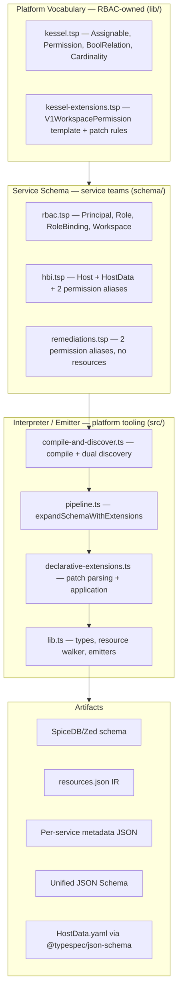

# TypeSpec POC Review Against KSL-055

**Audience:** RBAC platform, service schema authors, and evaluators comparing schema representation finalists.
**Scope:** `poc/typespec-as-schema` evaluated against the benchmark and fitness criteria defined in [KSL-055: Kessel Schema Representation Finalists](../../../docs/KSL-055_%20Kessel%20Schema%20Representation%20Finalists.md).
**Date:** April 15, 2026

---

## 1. Context

KSL-055 defines a benchmark for evaluating schema representation candidates, covering:

1. A simplified RBAC + HBI access schema with relationships and extensions
2. Input validation rules (relationship properties, cardinality)
3. Arbitrary metadata (v1 permission, application, resource, verb) from extension calls
4. An advanced extension with conditional logic and accumulation

Candidates are graded on benchmark completeness, IDE support, AI support, subjective usability, and runtime dependencies. The TypeSpec row in the KSL-055 summary table was left blank. This document fills it in based on the implemented POC.

---

## 2. Benchmark Coverage

| Requirement | Status | Evidence |
|---|---|---|
| RBAC + HBI access schema with relationships and extensions | **Met** | `schema/rbac.tsp` defines Principal, Role, RoleBinding, Workspace with typed Kessel relations. `schema/hbi.tsp` defines Host with cross-namespace workspace relation and view/update permissions. Extensions wire permissions into all three RBAC types via `V1WorkspacePermission` aliases. 38 benchmark tests confirm structural match against the golden reference (`evaluation/golden-outputs/spicedb-reference.zed`). |
| Input validation rules (cardinality, format) | **Met** | `lib/kessel.tsp` defines a `Cardinality` enum (AtMostOne, ExactlyOne, AtLeastOne, Any, All). HBI Host declares `workspace: Assignable<Workspace, ExactlyOne>`. The unified JSON Schema emitter generates `*_id` fields with format and required constraints derived from cardinality. The built-in `@typespec/json-schema` emitter handles native validation (`@format`, `@maxLength`, `@pattern`) via the `HostData` model. |
| Arbitrary metadata (v1 permission, application, resource, verb) | **Met** | `V1Extension` carries all four fields. `generateMetadata()` produces per-application permission and resource lists. `generateIR()` bundles extensions, metadata, SpiceDB output, and JSON Schemas into a single `resources.json` artifact. |
| Advanced extension with conditional logic and accumulation | **Met** | The `workspace_accumulate` patch rule implements `view_metadata = or(inventory_host_view, remediations_remediation_view)` with a `when={verb}==read` conditional gate. Two-pass accumulation in `applyDeclaredPatches` collects refs from qualifying extensions in Pass 1 and merges them in Pass 2. |

**All four benchmark requirements are satisfied.** The test suite (125 tests, 13 files, all passing) includes golden-reference structural comparison, feature coverage checks, and unit tests for every parser and emitter function.

---

## 3. Architecture Overview



Three ownership layers:

- **`lib/`** — Platform vocabulary owned by RBAC. Defines marker models (`Assignable`, `Permission`, `BoolRelation`) and the `V1WorkspacePermission` template with declarative patch rules. Service teams import but never edit these.
- **`schema/`** — Service schemas. Each team owns its file. Adding a new service means creating one `.tsp` file with alias declarations and adding one import to `schema/main.tsp`. No TypeScript knowledge required.
- **`src/`** — Generic interpreter / emitter. Extension-agnostic: it knows how to parse patch-rule syntax but has zero knowledge of specific extension patterns. Produces SpiceDB, IR, metadata, and unified JSON Schema.

---

## 4. Fitness Criteria Scores

KSL-055 grades candidates on five axes. Based on the implemented POC:

| Criterion | Score | Rationale |
|---|---|---|
| **Benchmark** | **5** | All four requirements met. 125 tests passing. Golden reference structural match. |
| **IDE Support** | **4** | TypeSpec has an official VS Code extension with a full language server: autocomplete, go-to-definition, hover docs, inline diagnostics. Template parameters are type-checked. Better than KSL (2), Starlark (2), JSONSchema (2); comparable to CUE (4). |
| **AI Support** | **5** | TypeSpec is Microsoft-maintained and well-represented on GitHub. The schema files use consistent, pattern-based syntax that AI models handle well. The KSL-055 document notes AI was "not especially selective" across candidates. |
| **Usability** | **4** | Service authoring is lean: one `alias` + one `model` per service. `hbi.tsp` is 81 lines covering relations, data validation, and permissions. Less verbose than TypeScript's deferred patterns. More conventional syntax than CUE's unification operator. The template param convention (`application`, `resource`, `verb`, `v2Perm`) is intuitive. |
| **Dependencies** | **4** | Requires Node.js + `@typespec/compiler` at build time. Not at runtime — the output is a static JSON IR embedded by Go via `//go:embed`. The transpiler-step concern raised for TypeScript in KSL-055 applies here too, but the compile step is simpler (no module loader needed, no deferred-execution patterns). |

### Updated summary table (filling in the TypeSpec row)

| Candidate | Benchmark | IDE Support | AI Support | Usability | Dependencies |
|---|---|---|---|---|---|
| KSL | 4 | 2 | 5 | 3 | 5 |
| JSONSchema | 3 | 2 | 5 | 3 | 5 |
| **TypeSpec** | **5** | **4** | **5** | **4** | **4** |
| CUE | 5 | 4 | 5 | 2 | 5 |
| TypeScript | 5 | 5 | 5 | 4 | 4 |
| Starlark | 5 | 2 | 5 | 4 | 5 |

---

## 5. Comparison with Other Finalists

KSL-055 identified the key differentiator as the ability to handle **advanced extensions without maintenance-heavy backend changes**. The document describes TypeSpec's approach as:

> *"data is collected declaratively while outputs are generated with TypeScript, allowing for a programmable layer"*

The POC validates this claim.

### vs KSL

KSL was dropped because advanced extensions needed "scripting-oriented features" that blocked adoption, with risk of discovering new missing capabilities in the future. TypeSpec's programmable TypeScript layer (`declarative-extensions.ts`) handles conditional logic and accumulation without modifying the schema language itself. The patch-rule vocabulary is extensible: new `{target}_{patchType}` conventions can be added to the template and the applicator without changing the service-facing `.tsp` syntax.

### vs CUE

CUE handles extensions via unification intrinsics. The KSL-055 document flags usability as its main issue: "the syntax is unusual and while decently readable on a good day... it can be very difficult to write for all but the most trivial use cases." TypeSpec's alias-based syntax is more conventional:

```
// CUE: unification operator
inventory_host_view: _V1WorkspacePermission & {application: "inventory", ...}

// TypeSpec: standard generic alias
alias viewPermission = Kessel.V1WorkspacePermission<"inventory", "hosts", "read", "inventory_host_view">;
```

### vs TypeScript

TypeScript scores highest on IDE support (5) but KSL-055 notes the "time dimension" leak: "some overly verbose syntax in order to make everything that might have external dependencies deferred until everything is known to be ready." TypeSpec avoids this entirely — the compiler handles evaluation order, and service authors write pure data declarations. The cost is one less point on IDE support (4 vs 5), since TypeSpec's language server is mature but not as ubiquitous as TypeScript's.

### vs Starlark

Starlark needed "host-provided functions that create an overlay in the host" for extensions. TypeSpec's approach is structurally similar (patch rules are "host-provided" via the emitter) but the service-facing syntax is cleaner. Starlark's IDE support (2) and extensive magic strings are a significant disadvantage compared to TypeSpec's typed templates.

---

## 6. What the POC Demonstrates Well

**Single-representation simplification.** A service developer writes one `.tsp` file that covers:
- Authorization relationships (SpiceDB output)
- Data field validation (JSON Schema output)
- Extension metadata (IR output)
- Permission wiring into RBAC (declarative patches)

This directly addresses the KSL-055 goal: *"If service developers could express their schema requirements in a single representation, it would simplify their learning requirements."*

**Zero-service-code extensions.** Adding a new service with standard workspace permissions requires:
1. Create `schema/<service>.tsp` with alias declarations
2. Add one `import` line to `schema/main.tsp`
3. Run the emitter

No TypeScript changes. No emitter changes. The template does the rest.

**Language-agnostic artifact.** The `resources.json` IR carries expanded resources, SpiceDB text, metadata, and JSON Schemas in a single JSON file. The Go consumer embeds it at build time. Zero runtime dependency on TypeSpec, Node.js, or any JavaScript toolchain.

**Strong test infrastructure.** 125 tests across unit and integration levels, including:
- Golden reference comparison against the benchmark SpiceDB output
- Template drift guard (compiled `.tsp` vs frozen TypeScript copy)
- Strict-mode error handling for malformed patch rules
- Parser coverage for every rule syntax

---

## 7. Known Gaps and Risks

| Gap | Severity | Detail | Mitigation |
|---|---|---|---|
| New patch kinds require emitter changes | Medium | Adding a new `{target}_{patchType}` convention means modifying `declarative-extensions.ts`. This is the same risk KSL-055 flagged for KSL ("missing capability again in the future"). | The patch-rule DSL is designed to be extensible. New patch types can be added to the applicator without changing the service-facing `.tsp` syntax or existing patch types. A plugin/registry architecture (documented in the [Design Document §8](./TypeSpec-POC-Design-Document.md#8-architecture-ownership-and-tensions)) would reduce this further. |
| No plugin architecture yet | Low (POC scope) | Multiple extension template families (beyond `V1WorkspacePermission`) would need parallel discovery and potentially separate applicators. | Documented as a follow-up direction. The architecture supports it: add new templates in `lib/`, add corresponding discovery in `src/`. |
| Namespace normalization | Low | The golden reference uses `hbi/host` while the emitter produces `inventory/host` (matching the TypeSpec `namespace Inventory`). Tests account for this via a mapping table. | A naming convention decision, not a technical limitation. |
| `rbac` excluded from unified JSON Schema | Low | `generateUnifiedJsonSchemas` skips `namespace === "rbac"`. | Deliberate POC scope choice. Documented as a straightforward follow-up enhancement. |
| Node.js build-time dependency | Low | TypeSpec compilation requires Node.js. | Build-time only. Runtime artifacts are static JSON. CI pipelines already use Node.js. |

---

## 8. Conclusion

The TypeSpec POC **fully satisfies the KSL-055 benchmark** and demonstrates the architectural advantage the design document attributes to it: declarative data collection in `.tsp` with a programmable TypeScript output layer. It fills the blank row in the KSL-055 summary table with competitive scores across all five criteria.

Relative to the other finalists:
- It avoids KSL's extensibility ceiling
- It avoids CUE's usability issues
- It avoids TypeScript's deferred-execution complexity
- It matches Starlark's declarative readability with better IDE support and type safety

The main risk — new patch kinds needing emitter changes — is shared with other candidates and explicitly documented as a follow-up concern, not a design flaw. The codebase is clean (125 tests passing, dead code removed, API surface tightened) and ready for stakeholder evaluation.

---

*For full pipeline details and implementation walkthrough, see [TypeSpec POC Design Document](./TypeSpec-POC-Design-Document.md).*
